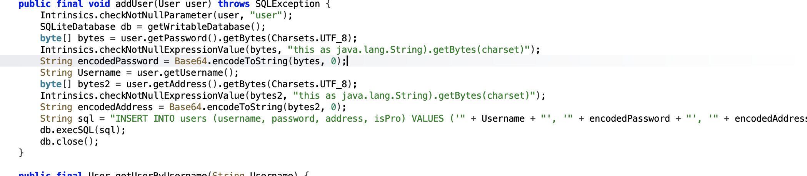
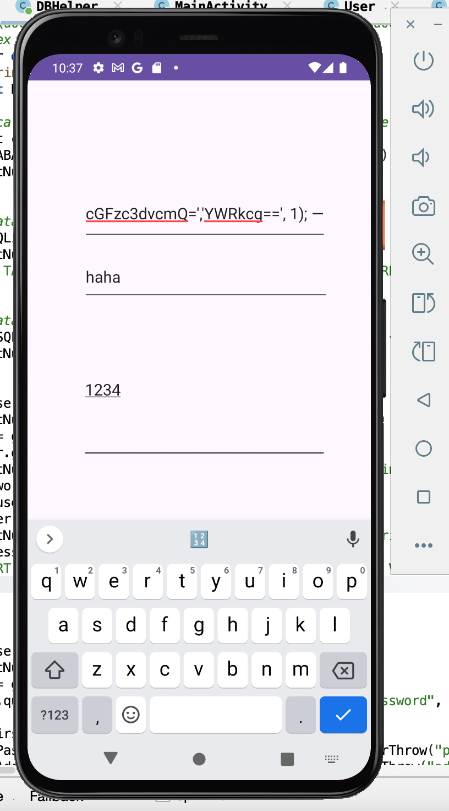
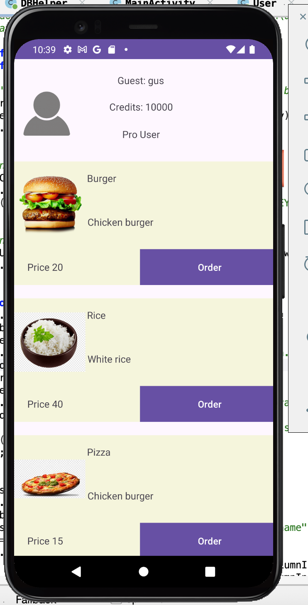

This is my writeup for the **FoodStore** Android challenge by [Mobile Hacking Labs](https://www.mobilehackinglab.com/) - a straightforward but satisfying SQL injection challenge hidden inside a food delivery app.

---

**Objective:** Exploit a SQL Injection vulnerability in the signup function to register a Pro user (10,000 credits) and bypass normal restrictions.

---

## Environment

- Android app: `com.mobilehackinglab.foodstore`
- Vulnerable class: `DBHelper` (uses `SQLiteOpenHelper` and `execSQL` with string concatenation)
- DB: `userdatabase.db`, table `users(id, username, password, address, isPro)`

---

## Vulnerable Code



```java
String sql = "INSERT INTO users (username, password, address, isPro) VALUES ('" + Username + "', '" + encodedPassword + "', '" + encodedAddress + "', 0)";
db.execSQL(sql);
```

The `Username` value is concatenated directly into the SQL statement. An attacker-controlled string can close the open quote, inject arbitrary SQL, and comment out the remainder - resulting in a row with `isPro = 1`.

---

## Attack Strategy

Two practical approaches:

1. **Tuple injection (single statement):** Close the username string, provide a full `VALUES(...)` tuple including Base64-encoded `password` and `address`, set `isPro = 1`, then comment out the rest.
2. **Second-statement injection:** Close the string and inject an additional `UPDATE` statement to flip `isPro` on an existing account.

Tuple injection is preferred for reliability.

---

## Payload



Entered in the **username** field during registration:

```
gus', 'cGFzc3dvcmQ=', 'YWRkcg==', 1); --
```

- `cGFzc3dvcmQ=` is Base64 of `password`
- `YWRkcg==` is Base64 of `addr`
- `--` comments out the rest of the original SQL

**Why Base64?** The app encodes passwords and addresses with Base64 before inserting. When `getUserByUsername()` retrieves the record it Base64-decodes the stored values. The injected values must be pre-encoded so the decode step yields the intended plaintext credentials.

---

## Resulting SQL

After injection, the executed statement becomes:

```sql
INSERT INTO users (username, password, address, isPro) VALUES ('gus', 'cGFzc3dvcmQ=', 'YWRkcg==', 1); --', '<ENC_PW>', '<ENC_ADDR>', 0)
```

Everything after `--` is ignored, so the DB inserts the attacker-specified row with `isPro = 1`.

---

## Verification

- Username: `gus`
- Password: `password`
- Address: `addr`



Login with `gus` / `password` - the account shows as **Pro** with 10,000 credits.

---

## Mitigations

1. **Use parameterized queries** - never concatenate user input into SQL. Use `ContentValues` / `db.insert()` or `SQLiteStatement` with bound parameters.
2. **Never store passwords reversibly** - use `bcrypt`, `PBKDF2`, or `Argon2` with a per-account salt. Base64 is encoding, not hashing.
3. **Validate inputs** - treat client-side input as hostile; server-side validation is mandatory.
4. **Avoid executing multiple statements** from a single untrusted string.
