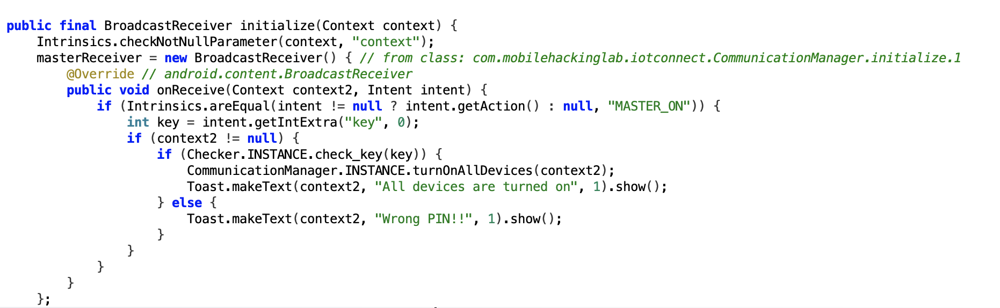
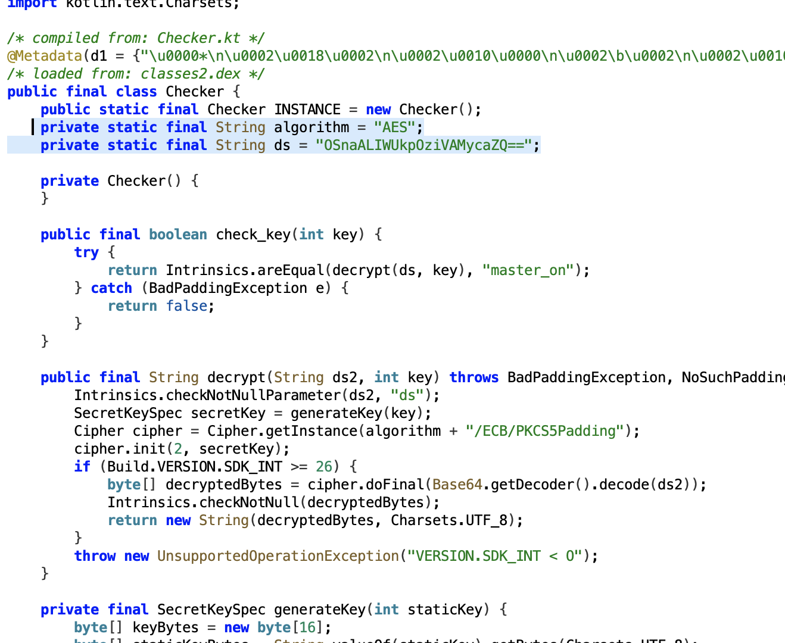
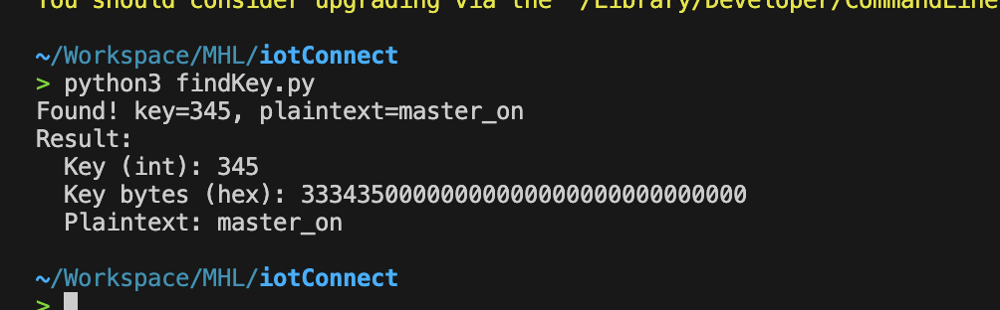
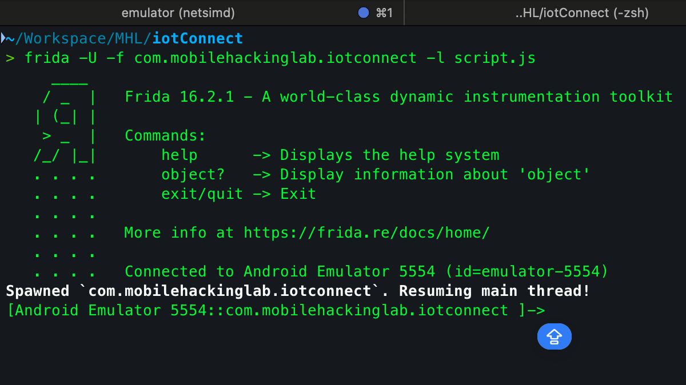
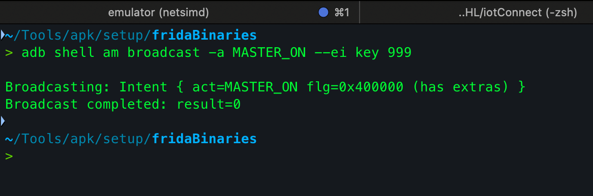
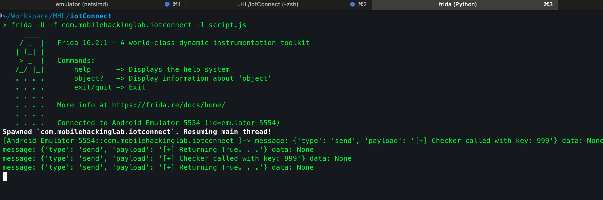
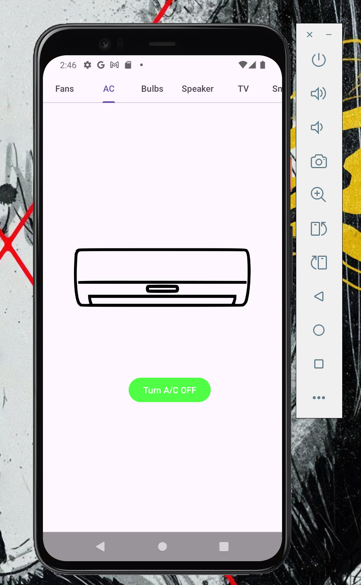

This is my writeup for the **IOT Connect** Android challenge by [Mobile Hacking Labs](https://www.mobilehackinglab.com/) - I ended up solving it two different ways, which made it a great exercise in both static crypto analysis and dynamic instrumentation.

---

**Objective:** Gain the ability to turn on all devices (master switch) by bypassing the PIN check - either by reversing to recover the PIN or hooking the check function at runtime.

---

## Summary

Two effective approaches to solve this challenge:

1. **Reverse + bruteforce the encrypted static key** - offline crypto attack on the hardcoded ciphertext. Result: recovered integer key **`345`**, which decrypts to `"master_on"`. Use this key in an `adb shell am broadcast` to trigger the master switch.
2. **Runtime hook (Frida)** - instrument the app and force `Checker.check_key()` to return `true`. No cryptanalysis needed.

I solved it using both approaches. The Frida route is simpler and recommended.

---

## Environment & Relevant Findings

- App package: `com.mobilehackinglab.iotconnect`
- The app registers a `BroadcastReceiver` for action `MASTER_ON`. The receiver reads an integer extra named `key` and calls `Checker.check_key(key)`. If true → `turnOnAllDevices()`.



- Hardcoded ciphertext: `OSnaALIWUkpOziVAMycaZQ==` (variable `ds` in `Checker`)



- Crypto: `AES/ECB/PKCS5Padding`, key derived from the string form of the integer PIN left-justified into 16 bytes (e.g. `"345"` → bytes `33 34 35 00 ... 00`)

---

## Approach A - Reverse & Bruteforce

`ds` is static and the key derivation is trivial. Offline bruteforce over a small integer range is enough.

```python
from base64 import b64decode
from math import ceil
import sys

try:
    from Crypto.Cipher import AES
except Exception:
    try:
        from Cryptodome.Cipher import AES
    except Exception as e:
        raise ImportError("pycryptodome not available. Install with: pip install pycryptodome") from e

CIPHERTEXT_B64 = "OSnaALIWUkpOziVAMycaZQ=="
TARGET_PLAINTEXT = b"master_on"
MAX_KEY = 999999
REPORT_EVERY = 100000

ct_bytes = b64decode(CIPHERTEXT_B64)

def generate_key_bytes(key_int: int) -> bytes:
    s = str(key_int).encode('utf-8')
    if len(s) >= 16:
        return s[:16]
    return s + b'\x00' * (16 - len(s))

def pkcs5_unpad(b: bytes) -> bytes:
    if not b:
        return b
    pad_len = b[-1]
    if pad_len < 1 or pad_len > 16:
        raise ValueError("Invalid padding length")
    if b[-pad_len:] != bytes([pad_len]) * pad_len:
        raise ValueError("Invalid padding bytes")
    return b[:-pad_len]

found = False

for key in range(0, MAX_KEY + 1):
    if key % REPORT_EVERY == 0 and key != 0:
        print(f"Checked up to {key}", flush=True)
    key_bytes = generate_key_bytes(key)
    cipher = AES.new(key_bytes, AES.MODE_ECB)
    try:
        dec = cipher.decrypt(ct_bytes)
        plain = pkcs5_unpad(dec)
        if plain == TARGET_PLAINTEXT:
            print(f"Found! key={key}, plaintext={plain.decode()}")
            found = True
            break
    except Exception:
        continue

if not found:
    print(f"No key found in range 0..{MAX_KEY}")
```

### Result



### Using the Key

```bash
adb shell am broadcast -a MASTER_ON --ei key 345
```

---

## Approach B - Frida Hook

Replace `Checker.check_key()` in memory to always return `true`, so any broadcast with any key succeeds.

```js
Java.perform(function () {
  try {
    var checker = Java.use("Checker");
    checker.check_key.implementation = function (key) {
      send("[+] Checker called with key: " + key);
      send("[+] Returning True...");
      return true;
    };
  } catch (e) {
    send("[!] error: " + e);
  }
});
```

### Hooking



### After Hooking - Send any broadcast



The hooked `check_key` returns `true`, activating the master switch.




AC is on brrrrrrr
