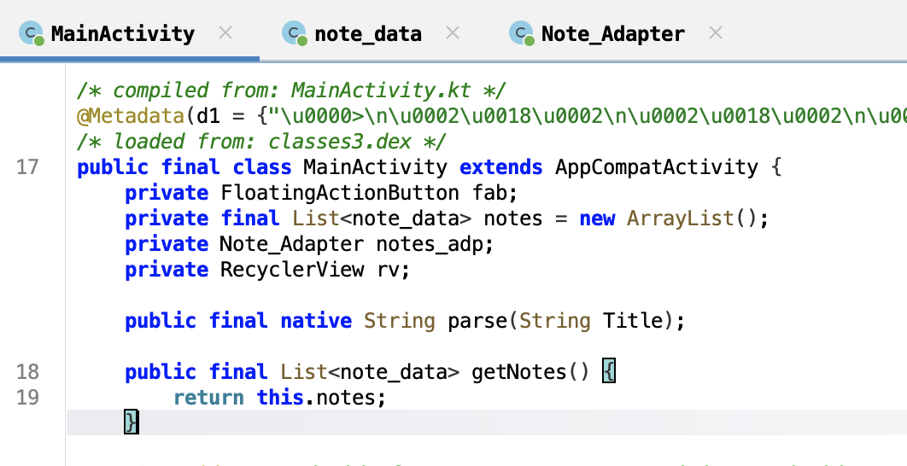
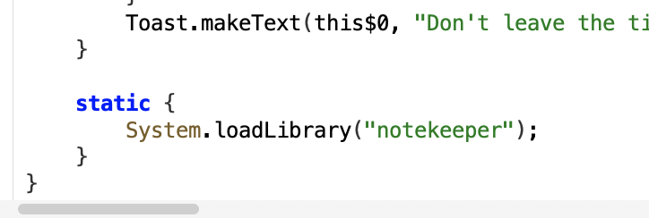
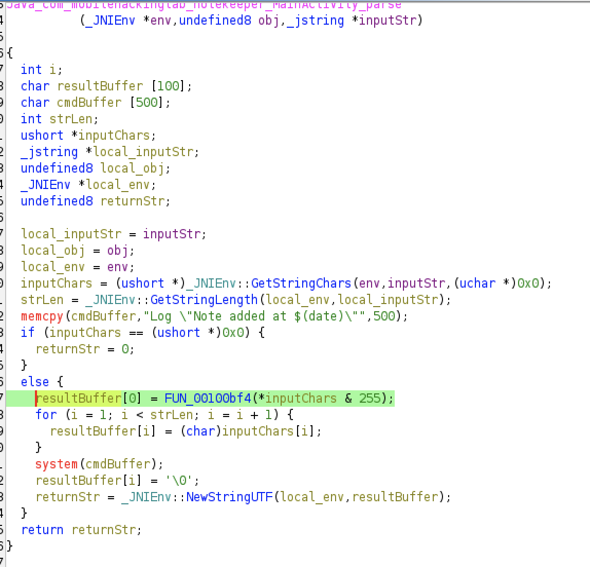
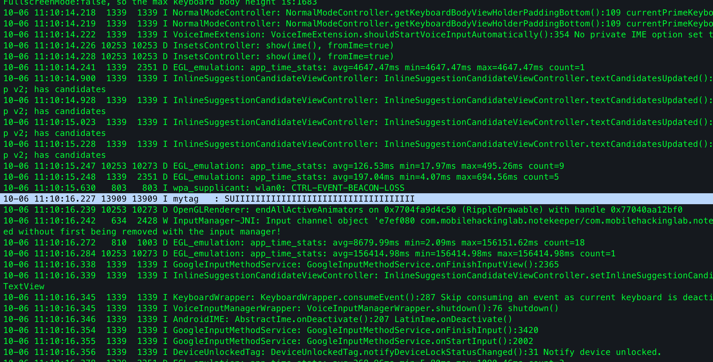

This is my writeup for the **Note Keeper** Android challenge by [Mobile Hacking Labs](https://www.mobilehackinglab.com/) - one of the more interesting challenges in the lab since it gets into native code exploitation rather than the usual Java layer.

---

I found a native stack buffer overflow in the Note Keeper challenge that lets me control the command string passed to `system()` from the app's JNI code.

---

## Overview

The APK takes **Title** and **Content** as inputs, and passes the title to `parse()` - a native function defined in `libnotekeeper.so`.




---

## Vulnerability

While poking around `MainActivity.parse()` in `libnotekeeper.so` I noticed it reads the Java title with `GetStringLength` / `GetStringChars` and copies the characters into a fixed `char resultBuf[100]`. Right next to it on the stack is a `char cmdBuf[500]` prefilled with the literal `Log "Note added at $(date)"`. The native code then calls `system(cmdBuf)`.



Because there's no bounds check, giving a long title overwrites `resultBuf`'s boundary and starts writing into `cmdBuf`. In this build `resultBuf` and `cmdBuf` are adjacent with no gap, so it's trivial to corrupt the start of `cmdBuf`.

From the Ghidra stack frame:
- `resultBuffer` at `sp-0x2a4`
- `cmdBuffer` at `sp-0x240` (adjacent)

---

## Exploit

```python
payload = "A" * 100
payload += 'log -t mytag "SUIIIIIIIIIIIIIIIIIIIIIIIIIIIIIIIIIII"'
print(payload)
```

A title long enough to overflow `resultBuf` into `cmdBuf` changes the stored command into a `log` invocation. I proved this in the emulator - the injected message appeared in `adb logcat`.



**Primitive:** buffer overflow in native `parse()` → controlled bytes land in `cmdBuf` → `system()` executes the modified command.

I used the `log` command as a harmless demonstration that arbitrary command execution is possible end-to-end.
