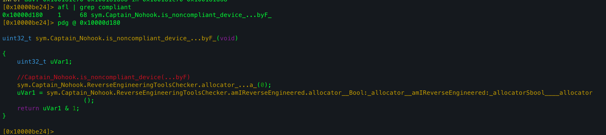
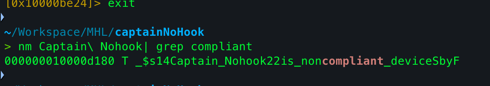
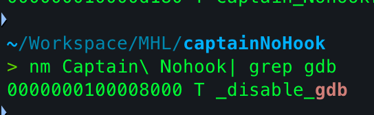
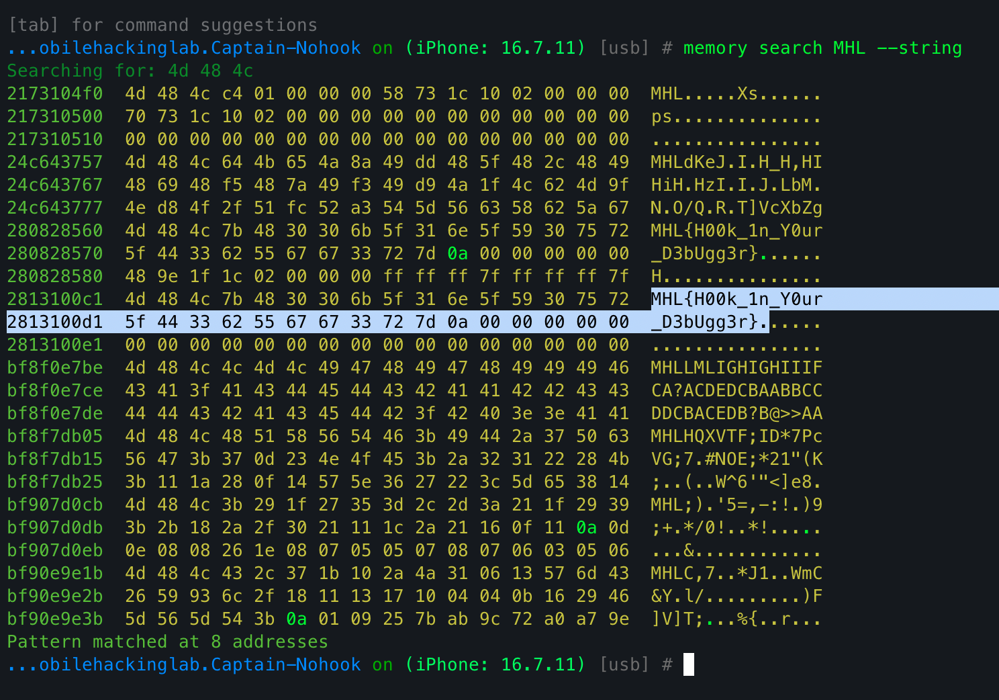

This is my writeup for the **Captain NoHook** iOS challenge by [Mobile Hacking Labs](https://www.mobilehackinglab.com/) - combining multiple runtime checks, a non-exported debugger trap, and a hidden flag buried in memory.

---

## Overview

A classic mobile RASP / anti-reversing puzzle. **Goal: bypass the app's reverse-engineering/compliance checks and find the hidden flag in memory.**

Combined **static analysis (radare2 / nm)** with **dynamic instrumentation (Frida)** and **Objection** for memory inspection.

---

## 1. Static Discovery with r2 / nm

Loaded the app binary into `r2` and searched for symbols/functions containing the term **`compliant`**. That quickly pointed at the high-level check deciding whether the device is "noncompliant".



Using `nm` I got the full mangled symbol name:



Which demangles to: `Captain_Nohook.is_noncompliant_device() -> Swift.Bool`

While browsing the binary I also identified many other checks - jailbroken environment, suspicious files, open ports, DYLD-injected libraries, ptrace/pselect flags, etc. All of them flow through `is_noncompliant_device()`.

---

## 2. Dynamic Bypass with Frida

### Why `Interceptor.replace` vs `Interceptor.attach`

- For small scalar-return functions like `is_noncompliant_device`, replacement with an appropriate `NativeCallback` is safe.
- For functions that return structs or use indirect returns (Swift `String`, complex structs), replace is dangerous unless you exactly match the ABI.
- For `disableGdb` the replacement was safe because I verified the ABI and entry point from static analysis first.
- When unsure, prefer `Interceptor.attach` with `onLeave` modification - less likely to crash the process.

### Dealing with `disableGdb` (non-exported)

I found a `disableGdb` routine that tries to detect or disable debuggers. It wasn't exported, so I couldn't call it by name.

**Solution:** compute the function address as `module_base + hardcoded_offset` (offset discovered from static analysis, module base confirmed at runtime), then replace with an empty `NativeCallback`.



---

## Final Frida Script

```js
var disableGdbOffset = 0x8000;
var disableGdb = Process.getModuleByName("Captain Nohook").base.add(disableGdbOffset);
var newFunc = new NativeCallback(
  function () {
    console.log("[+] Bypassed gdb check");
  },
  "void",
  []
);

Interceptor.replace(disableGdb, newFunc);

const address = Module.findExportByName(null, "$s14Captain_Nohook22is_noncompliant_deviceSbyF");
if (address) {
  Interceptor.replace(address, new NativeCallback(() => {
    console.log("[+] Bypassed Compliant Check");
    return 0;
  }, 'int', []));
}
```

---

## 3. Finding the Flag with Objection

With all protections removed, Objection scanned memory and located candidate strings. I inspected the candidate regions to find the hidden flag.


