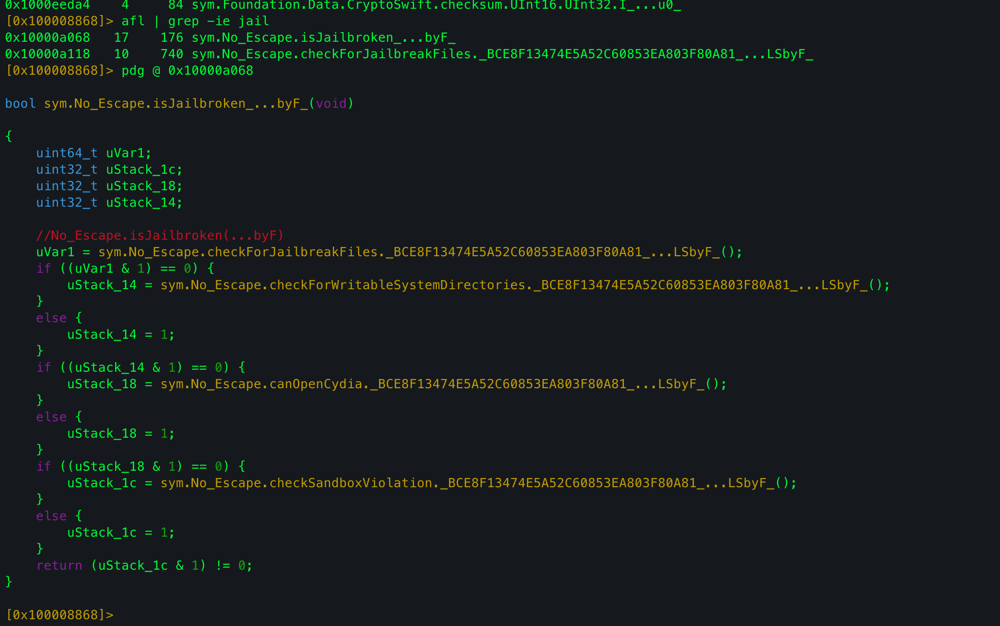
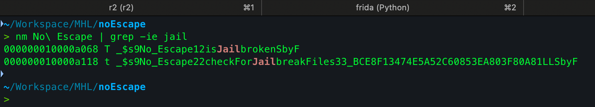
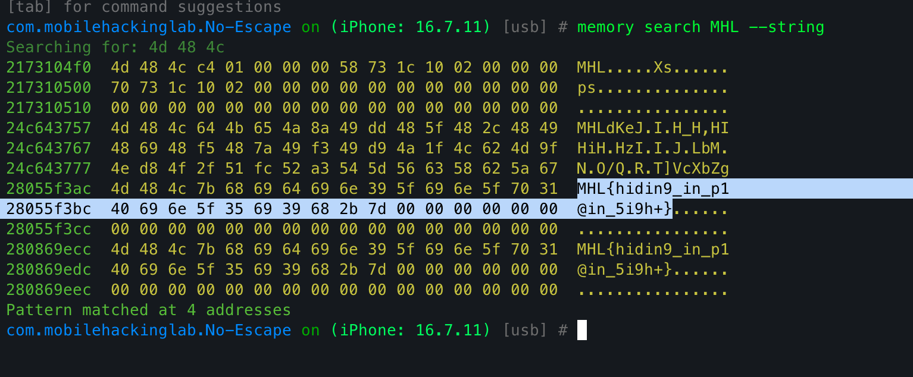

This is my writeup for the **No Escape** iOS challenge by [Mobile Hacking Labs](https://www.mobilehackinglab.com/) - a quick but clean jailbreak detection bypass that demonstrates how fragile single-function guards really are.

---

## Overview

A simple jailbreak detection bypass challenge. I downloaded the IPA, extracted it, and analyzed the binary with radare2. A few jailbreak detection methods were found:



All of them were called inside a single main detection function. I got its full mangled name using `nm`:



---

## Frida Script

```js
const address = Module.findExportByName(null, "$s9No_Escape12isJailbrokenSbyF");

if (address) {
  console.log("[+] Found the function: ", address);
  console.log("[+] Hooking...");

  Interceptor.replace(address, new NativeCallback(() => {
    console.log("[+] Bypassed!");
    return 0;
  }, 'int', []));
}
```

---

## Flag

After bypassing the checks, the flag appears in the UI. I used Objection to scan memory directly rather than reading it off screen:



`MHL{hidin9_in_p1@in_5i9h+}`
