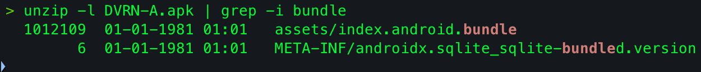
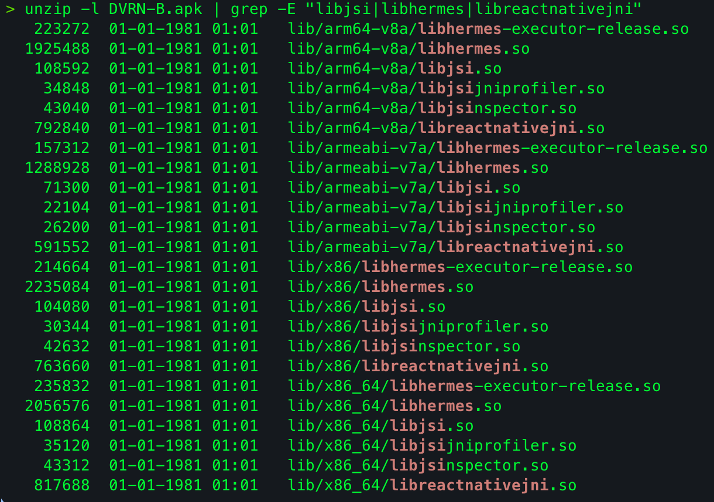
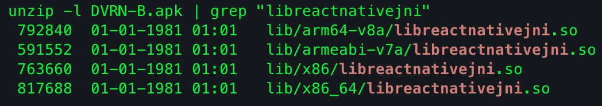
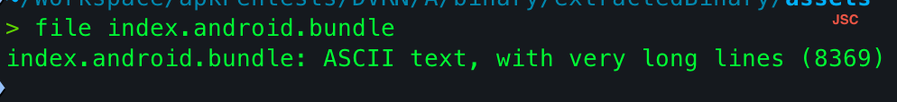
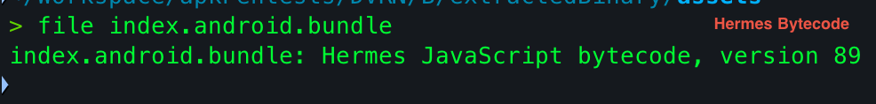
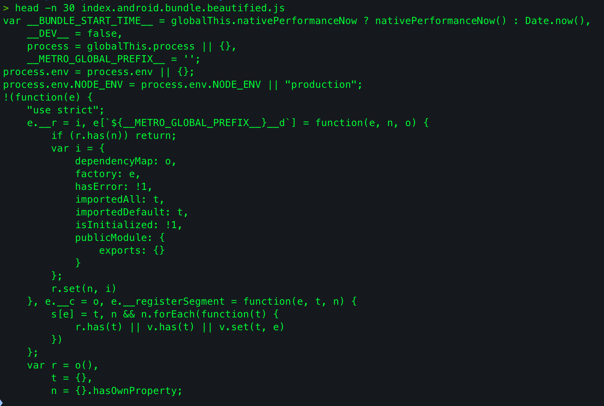

This is Part 1 of a two-part series on testing React Native applications. This part covers what you need to know before you start testing- identifying an RN app, understanding how it's actually built, and setting up the right recon workflow. Part 2 walks through exploiting five real vulnerabilities using DVRN, a deliberately vulnerable RN app I built specifically for this series.

---

## What is React Native, and why should a pentester care

React Native lets you write mobile apps in JavaScript, using React, and ship them as genuinely native Android and iOS apps. That last part matters more than it sounds. Instead of compiling your code into a web browser wrapper like traditional hybrid apps, it communicates directly with the host platform - your `<View>` and `<Text>` components become real `android.widget.*` views on Android, not HTML rendered inside a WebView. The JS layer decides what to show and how to respond to events; the actual rendering is native.

This matters for how you approach testing one. An RN app isn't "a website in a wrapper" the way a Cordova or old-school hybrid app is - you can't just point Burp at it and treat the whole thing like a web app with a native shell. There's a real JS execution environment, a real native layer, and a bridge connecting the two, and each of those three pieces has its own attack surface.

### The three-environment model

Every RN app is made of three distinct pieces, and almost everything you'll test maps onto one of them:

- **The JS layer** - your application logic, business rules, state, and UI decisions. Runs inside a JS engine (historically JavaScriptCore, now usually Hermes) bundled into the app.
- **The native layer** - real platform code (Kotlin/Java on Android, Swift/Obj-C on iOS) that does anything the JS layer can't do on its own: filesystem access, camera, Bluetooth, secure storage.
- **The bridge** - the mechanism connecting the two. On older RN apps this is a literal message-passing bridge (JSON-serialized calls, queued and processed asynchronously). Newer RN apps use JSI, which allows direct, synchronous calls between JS and native without that serialization step.

Almost every RN-specific vulnerability lives at one of these three layers, or at the boundary between two of them. A hardcoded secret lives in the JS bundle. An unvalidated native module lives in the native layer. A bridge-crossing without proper checks lives at the boundary. Keeping this model in your head is the single most useful thing you can carry into an RN engagement - it tells you where to actually look.

### Why "old bridge" apps are still worth knowing

React Native's new architecture (JSI, Fabric, TurboModules) has been the default since RN 0.76. Between 0.76 and 0.82, teams could still opt back into the old bridge with a single flag (`newArchEnabled=false`) if a critical native dependency wasn't ready yet. As of RN 0.82, that option is gone entirely - the toggle to disable the new architecture was removed from the framework, so any app built on 0.82+ is on the new architecture whether the team wanted that or not.

That might make it sound like everything in this series is already obsolete. It isn't, and the reason is simple: **apps don't get rebuilt every time the framework ships a breaking architectural change.** Migrating a real production app off the old bridge is a disruptive work - every third-party native module needs auditing for new-architecture compatibility before migration can even start, and most real migrations take somewhere between 2 and 8 weeks depending on how much custom native code the app has. For an app that isn't under active feature development, or one that's stable and shipping fine, there's often no business pressure to take on that cost and risk unless something else forces it.

That's why, in practice, encountering an old-bridge app on an engagement in 2026 isn't a fluke. Apps get pinned to older RN versions for all kinds of unrelated reasons - a native module that never got new-architecture support, a team that opted out during the 0.76-0.82 window and never circled back, or just a codebase nobody's actively touched since it shipped. Old-bridge testing techniques aren't legacy knowledge - they're current, practical knowledge for a large share of what's actually in production right now.

This entire series - DVRN included - is scoped to the old bridge. The new architecture doesn't have a _different_ bridge, it has _no_ bridge at all - JS and native hold direct references to each other and call each other's methods synchronously, in-process, with nothing to intercept in between. Every technique in this series (bridge interception, `@ReactMethod` hooking via the bridge's call mechanism, `getJSBundleFile()` redirection) depends on that intermediary layer existing. On a Bridgeless app, none of it applies as-is - that's a different research project, and one I'll be working on as a separate series down the line.

---

## Identifying a React Native app in the wild

Before you can apply anything from this series, you need to actually confirm you're looking at a React Native app. This sounds trivial, but on a real engagement you often start with just an APK and no other context - no source, no documentation, sometimes not even a confirmed tech stack from the client.

Here's what to check, roughly in order of how conclusive each signal is.

### The single strongest signal: the JS bundle itself

Extract the APK (a plain `unzip` works fine, you don't need apktool for this step) and look inside `assets/`:

```bash
unzip -l target.apk | grep -i bundle
```

If you see `assets/index.android.bundle`, you're looking at a React Native app. This file is the compiled JS bundle - the actual application logic - and its presence with this exact name is close to a certainty.


### Native libraries

Even without opening the bundle, RN apps carry distinctive native libraries under `lib/<arch>/`:

```bash
unzip -l target.apk | grep -E "libjsi|libhermes|libreactnativejni"
```

- `libhermes.so` - present if the app uses the Hermes JS engine
- `libjsi.so` - the JS Interface layer, present on both old and new architecture apps (though what's built on top of it differs significantly, as covered above)
- `libreactnativejni.so` - the JNI glue connecting Java/Kotlin to the native RN runtime



### Distinguishing from other hybrid frameworks

It's worth knowing what the _other_ common hybrid approaches look like, so you don't misidentify one for another mid-engagement:

- **Flutter** apps carry `libflutter.so` and a `flutter_assets/` folder containing the compiled Dart code - no JS bundle anywhere, since Flutter doesn't use JavaScript at all.
- **Cordova/Ionic** (the "traditional hybrid" approach mentioned earlier) ships a real `www/` folder full of actual HTML, CSS, and JS files, plus a `cordova.js` runtime file. If you can open the APK and find literal `.html` files sitting in assets, you're looking at a WebView-based hybrid app, not React Native - a fundamentally different testing approach (closer to a web app audit, since the UI genuinely is a webpage).

Confirming which of these three you're actually looking at takes under a minute and determines almost everything about how the rest of the engagement goes.

---

## Detecting the architecture: old bridge vs new, Hermes vs JSC

Once you've confirmed an app is React Native, the next question is which of the two architectures it's built on, and which JS engine it uses. These two things together determine almost every exploitation technique available to you - which is why this is a recon step, not an afterthought.

### Old bridge vs new architecture

Static file checks under `lib/<arch>/` are the fastest signal. Rather than checking for what's absent, it's more reliable to check for what's actually present - an old-bridge build carries `libreactnativejni.so`, the JNI glue implementing the legacy bridge itself:

```bash
unzip -l target.apk | grep "libreactnativejni"
```



If you're checking a target you suspect might be on the new architecture instead, the equivalent positive check is looking for the libraries that only exist once Fabric and TurboModules are in play:

```bash
unzip -l target.apk | grep -E "libfabric|libturbomodulejsijni"
```

`libfabric.so` and `libturbomodulejsijni.so` only exist on new-architecture builds - Fabric is the new renderer, TurboModules the new native module system. On an old-bridge app, this grep comes back empty.

### Hermes vs JSC

This one's simpler, and you can answer it from the bundle file alone, no decompiling required:

```bash
file assets/index.android.bundle
```

- If it reports something like `ASCII text` (possibly with `, with very long lines`), the bundle is plain, uncompiled JavaScript - meaning JSC, not Hermes.
  
- If it reports `Hermes JavaScript bytecode, version NN`, the app uses Hermes, and critically, `file` will also tell you the exact bytecode version (`NN`) - which is the single most important number for everything covered in Part 2, since it determines which disassembly/reassembly tooling actually applies to this specific target.
  

Worth remembering: Hermes bytecode version is tied to the RN version the app was built with, not something you can infer from the app's other characteristics. Always check the actual bundle rather than assuming based on how new or old the app looks - a surprising number of apps stay pinned to older RN versions for reasons that have nothing to do with security, as covered earlier.

---

## The JS bundle - extraction and readability

Once you've confirmed the engine and bytecode version, the next question is simple: can you actually read this app's logic? The answer depends entirely on which of three scenarios you're in.

### Scenario A: Plain JS (JSC, or Hermes disabled)

If `file` reported plain ASCII text on the bundle, you're in the easiest case. The bundle is minified JavaScript - genuinely readable, just cramped onto very few lines. Beautify it and it reads like real (if compressed) source:

```bash
npm install -g js-beautify
js-beautify assets/index.android.bundle > beautified.js
```

From here, grepping for property names, string literals, or specific logic (`grep -n "isPremium" beautified.js`) works exactly the way you'd expect on any JS file. No special tooling required beyond a beautifier.



### Scenario B: Hermes bytecode, tool-supported version

If `file` reported a Hermes bytecode version, the bundle isn't plain text anymore - it's compiled bytecode, and you need a disassembler before any of it is human-readable. Whether that disassembler can also **reassemble** (i.e., let you patch and rebuild a valid bundle, not just read one) depends entirely on which tool actually supports the specific bytecode version you're looking at.

This turned out to be a messy area. Tool version-support claims and tool version-support _reality_ frequently disagree - more than one fork I tested claimed support for a version and then crashed on the very first real bundle it touched. Every entry in the table below is something I personally verified end-to-end: disassemble, make a real edit, reassemble, and confirm the app still loads correctly with the patched bundle - not just "the tool claims to support this version."

| HBC Version    | Disassemble + Reassemble                                                                                                        |
| -------------- | ------------------------------------------------------------------------------------------------------------------------------- |
| 59, 62, 74, 76 | Original hbctool 0.1.5 (PyPI)                                                                                                   |
| 83-88          | [Kirlif/HBC-Tool](https://github.com/Kirlif/HBC-Tool)                                                                           |
| 89             | [Custom merged fork](https://github.com/waseeq14/hbctool-add-vers-o-90) OR Kirlif/HBC-Tool                                      |
| 90-96          | [Kirlif/HBC-Tool](https://github.com/Kirlif/HBC-Tool)                                                                           |
| 98             | [tzadik-a/hbctool](https://github.com/tzadik-a/hbctool) - confirmed via zero-edit round trip on a real client-engagement bundle |

Every tool listed above was personally tested with a zero-edit disassemble->reassemble round trip before being trusted for a real patch - meaning: disassemble with no changes at all, then immediately reassemble, and confirm the output is byte-identical (or at minimum, still loads without crashing) to the original.

Basic usage, once you've matched the right tool to your target's version:

```bash
hbctool disasm assets/index.android.bundle disasm_output/
```

This produces a folder of readable `.hasm` files - one holding the actual instructions, plus supporting files like a string table. Part 2 goes deep into actually reading and patching this output against a real vulnerability; for now, the point is just knowing which tool to reach for once you know your target's bytecode version.

### Scenario C: Hermes bytecode, no reassembly support (yet)

Sometimes you'll hit a bytecode version nothing in the table above covers for reassembly - reassembly tooling doesn't move as fast as Hermes itself does, and there's always a chance you're ahead of what's publicly supported for patching. That doesn't mean you're stuck reading nothing, though - disassembly and reassembly are two separate problems, and a version can have no working reassembler while still having a perfectly good disassembler.

[hermes-dec](https://github.com/P1sec/hermes-dec) (P1 Security) is worth knowing specifically for this case. It's a disassembler and decompiler - not a reassembler, it doesn't try to rebuild a patchable bundle - but it has broader version coverage than most of the reassembly-capable tools in the table above, and it's actively maintained. When you land on a bytecode version with no reassembly option, this is the tool to reach for to at least get readable output:

```bash
hermes-dec.hbc-disassembler assets/index.android.bundle -o disasm_output/
```

Two things are still true even in this no-reassembly case, and they matter enough to state plainly:

**String literals are still recoverable, regardless of bytecode version support.** Hermes stores string constants in a flat table, completely separate from compiled instruction logic. This holds whether or not a disassembler exists at all for the version in question - a plain `grep -a` or `strings` against the raw `.hbc` file will pull out any hardcoded string:

```bash
strings assets/index.android.bundle | grep -i "api_key\|secret\|token"
```

But if you do have disassembled output from a tool like hermes-dec, grep that instead of the raw bundle - the `.hasm` output gives you actual surrounding context (which function a string belongs to, what happens to it afterward), where a raw `strings` dump just gives you an isolated fragment with no idea what code actually uses it:

```bash
grep -n -B5 -A5 "isPremium" disasm_output/instruction.hasm
```

**Control flow is a different story entirely, and no amount of grepping fixes that.** An `if` statement, a comparison, a business-logic decision, isn't sitting in the string table - it's compiled into instructions, and reading those instructions (even via a good disassembler like hermes-dec) tells you what the logic _is_, but changing it requires reassembly, which is exactly the thing this scenario doesn't have. If a version genuinely has no working reassembler, static patching of logic isn't available to you, and you're left with runtime interception instead - hooking the app while it's actually running, rather than editing its files ahead of time.

---

## Native module enumeration - what works and what doesn't

Once you're inside a running app - via Frida, or React Native's own dev console - the obvious next move is to ask JS what native modules exist at all. There's a one-liner that looks like it should answer this directly:

```javascript
Object.keys(NativeModules);
```

On modern React Native, this comes back empty - `[]` - even while individual modules are fully live and callable if you ask for them by name. Worth understanding exactly why, since it's not a bug, and knowing the mechanism tells you what to do instead.

`NativeModules` isn't a plain object - it's implemented as a JS `Proxy`. A Proxy wraps a real object and lets you intercept specific operations performed on it, via handler functions called traps:

- A **`get` trap** intercepts "give me the property named X" - e.g., `NativeModules.DebugModule`.
- An **`ownKeys` trap** intercepts "list every property name this object has" - the operation `Object.keys()`, `Object.getOwnPropertyNames()`, and `for...in` all rely on internally.

RN's `NativeModules` Proxy only implements a `get` trap. There's no `ownKeys` trap at all. So asking for a specific module by name works fine - the `get` trap fires, lazily instantiates the module if it hasn't been already, and hands it back. But asking "what exists" has no trap to answer it, so `Object.keys()` just returns an empty array, regardless of how many modules are actually registered and callable.

This is a deliberate tradeoff, not an oversight. A real app can have dozens of native modules registered, and eagerly constructing all of them at startup would be wasted work if most sessions only ever touch a handful. Lazy instantiation, gated purely by name-based lookup, avoids that cost - at the price of the object being non-enumerable.

I haven't found a reliable way to make this Proxy enumerate itself - if you know one, I'd genuinely like to hear about it.

### The recon technique that actually works

Since runtime enumeration is a dead end, go static instead: decompile the APK with jadx and look for the structural markers of a native module directly in the source.

```bash
grep -rn "ReactContextBaseJavaModule" decompiled_output/
grep -rn "@ReactMethod" decompiled_output/
```

Three things confirm you've found one:

- The class **extends `ReactContextBaseJavaModule`** - this is what makes a class eligible to be a native module at all.
- **`getName()`** returns the exact string JS uses to reach it - `NativeModules.<whatever this returns>`.
- **`@ReactMethod`** marks which specific methods actually cross the bridge and become callable from JS - a method without this annotation is just a normal, unreachable-from-JS function, regardless of what the class around it does.

Here's what that looks like on a real decompiled module from DVRN, opened in jadx-gui:


`DebugModule` extends `ReactContextBaseJavaModule`, `getName()` returns `"DebugModule"`, and `@ReactMethod` is visible on the one method this class exposes. That's the complete picture: a name to call it by, and a method that's actually reachable from JS. Once you've found a module this way, you know exactly what's callable - Part 2 walks through actually calling one of these directly, bypassing the JS layer entirely.

---

In Part 2, we'll go through DVRN, a deliberately vulnerable React Native app I built specifically for this series, and walk through five real vulnerabilities across three build variants - covering the scenarios we discussed.
