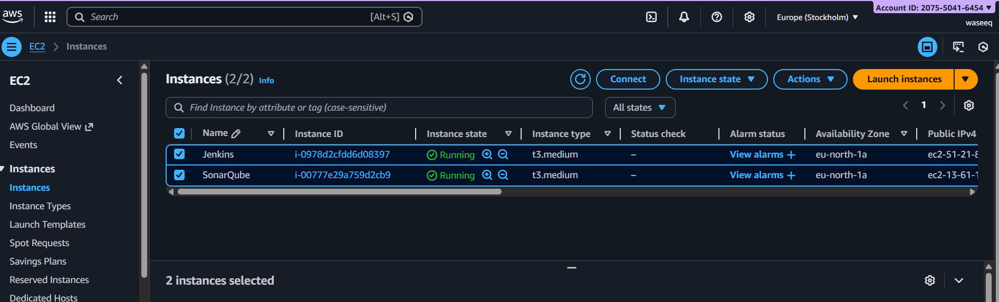
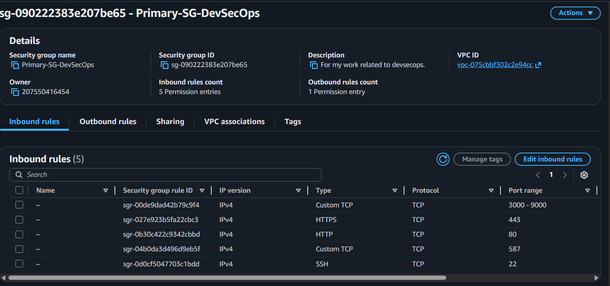
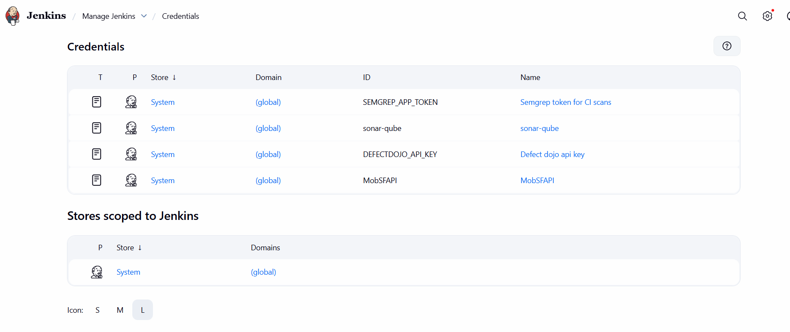
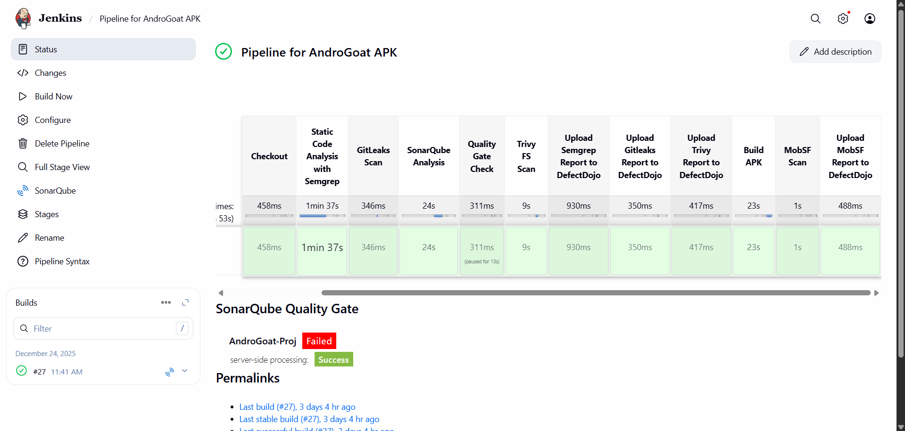
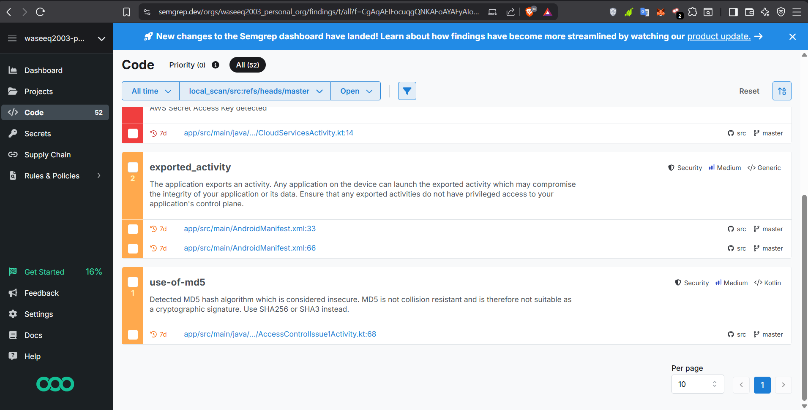
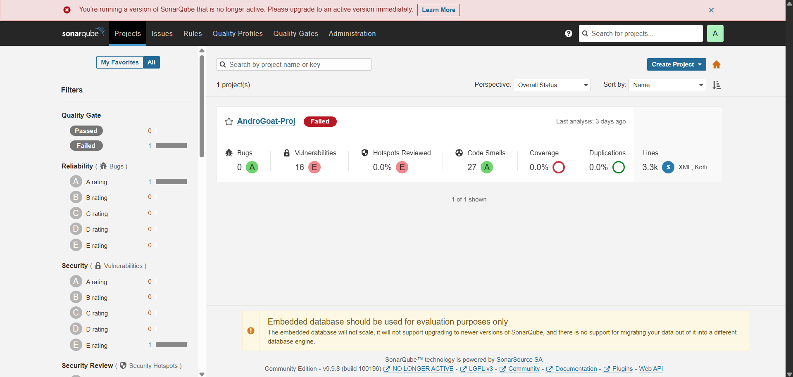
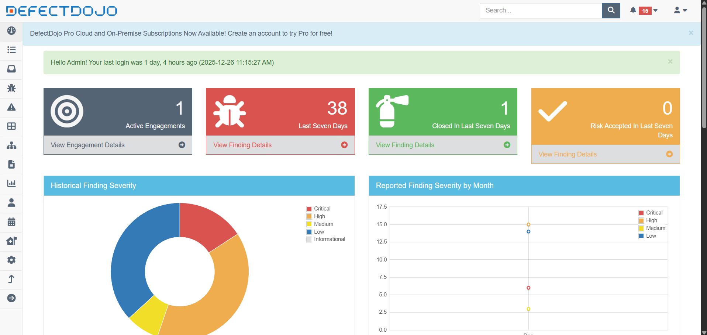
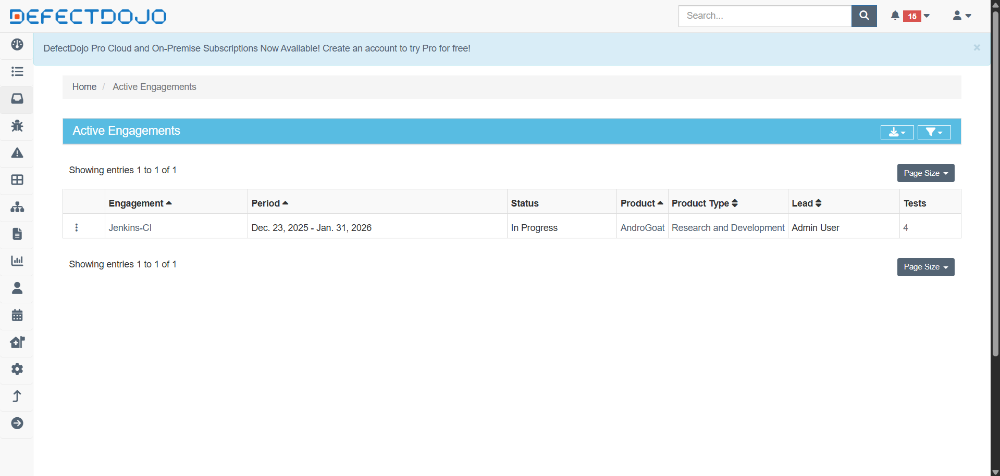
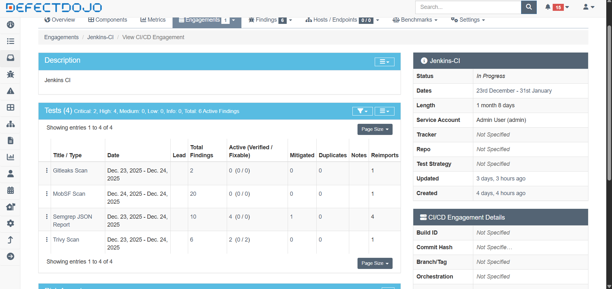
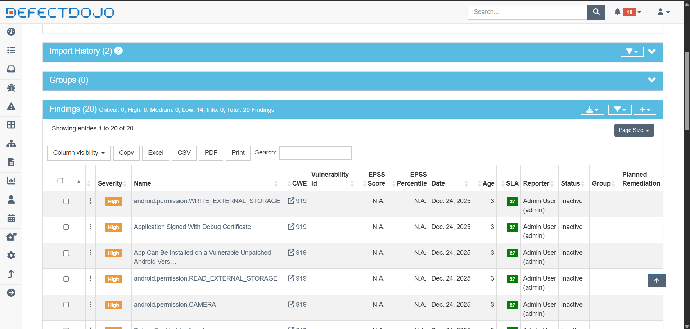

## Introduction

As mobile applications evolve rapidly, security can no longer be treated as a post-deployment activity. Modern DevSecOps practices emphasize continuous security testing, ensuring vulnerabilities are identified early, tracked centrally, and remediated efficiently.

In this project, I implemented a fully automated DevSecOps pipeline for Android applications using Jenkins. The pipeline integrates multiple industry-standard security tools to cover source code analysis, secrets detection, dependency and filesystem scanning, and mobile-specific vulnerability assessment.

The objective was simple: every build should be automatically tested, scanned, and reported without manual intervention.

---

## High-Level Architecture

The solution was deployed across two AWS EC2 instances to maintain separation of concerns and improve overall stability and performance.



### EC2 Instance 1 - CI & Build Environment

This instance hosted:

- Jenkins for CI/CD orchestration
- Android SDK & Gradle for building APKs
- Multiple security scanning tools (Semgrep, Gitleaks, Trivy)
- Pipeline execution and artifact management

### EC2 Instance 2 - Security Services

This instance hosted:

- MobSF for mobile application security testing
- SonarQube for code quality and static analysis
- DefectDojo for centralized vulnerability management

While this entire setup can be deployed locally, I chose AWS to better simulate a real-world enterprise environment and gain hands-on cloud experience.

---

## Connecting with the Machines

I used [MobaXterm](https://mobaxterm.mobatek.net/) for SSH access and session management. To avoid repeatedly modifying firewall rules during setup, I opened a broader range of ports to support all required services.



Elastic IPs were also assigned to both instances for consistent access. AWS documentation for this can be found [here](https://docs.aws.amazon.com/AWSEC2/latest/UserGuide/working-with-eips.html).

---

## Jenkins Setup

Jenkins was used as the central CI/CD orchestrator for the entire pipeline. It was deployed on a dedicated AWS EC2 instance running Ubuntu, isolated from scanning tools to keep the architecture clean and modular.

Key setup steps:

- Installed Jenkins on Ubuntu with OpenJDK as the runtime
- Configured required plugins: Pipeline, Git, Credentials Binding, DefectDojo Plugin
- Set up secure credentials for Git repository access, MobSF API key, and DefectDojo API key
- Installed Android build dependencies, SDK Manager, and CLI utilities for API-based integrations



The pipeline gets the repo, performs security testing across all integrated tools, builds the Android APK, sends it to MobSF for static analysis, and collects all scan results into DefectDojo for centralized vulnerability management.



Notice the SonarQube Quality Gate showing "Failed" for the AndroGoat project at the bottom - that's exactly what we want to see for an intentionally vulnerable application.

---

## Pipeline Stages

### 1. Source Code Checkout

The pipeline begins by pulling the Android application source code from GitHub. For this project, I used the intentionally vulnerable [AndroGoat](https://github.com/satishpatnayak/AndroGoat) repository.

### 2. Static Code Analysis - Semgrep

Semgrep is executed using Docker to scan the codebase against predefined security rules. A JSON report is generated and stored for later processing.

To use Semgrep, an account must be created at [semgrep.dev](https://semgrep.dev/), and an API token generated via Settings > Tokens > API Tokens. This token is stored securely in Jenkins credentials and referenced within the pipeline.



Semgrep caught some real findings here - an AWS Secret Access Key in the source, exported activities in the manifest, and insecure MD5 usage in the code. Exactly the kind of things you want caught before a build ships.

### 3. Secrets Detection - Gitleaks

Gitleaks scans the repository for exposed credentials, API keys, and other sensitive secrets.

Since AndroGoat is intentionally vulnerable, Gitleaks findings were configured not to fail the pipeline (`|| true` in the script). In a production environment, any secrets detection should immediately block the build until resolved.

### 4. Code Quality & Security - SonarQube

SonarQube was deployed following the official documentation for [server setup](https://docs.sonarsource.com/sonarqube-server/10.5/setup-and-upgrade/install-the-server/installing-sonarqube-from-docker) and [Jenkins integration](https://docs.sonarsource.com/sonarqube-server/10.8/analyzing-source-code/ci-integration/jenkins-integration/global-setup).



SonarQube analyzes the codebase for bugs, code smells, security hotspots, and maintainability issues. A quality gate is enforced to ensure minimum code quality standards are met before proceeding. AndroGoat predictably failed with 16 vulnerabilities and an E security rating - exactly what an intentionally vulnerable app should produce.

### 5. Filesystem Vulnerability Scan - Trivy

Trivy was installed following the [official setup guide](https://trivy.dev/docs/latest/getting-started/installation/). It performs filesystem scans to detect vulnerable dependencies, misconfigurations, and known CVEs. Scan results are exported in JSON format for centralized reporting.

### 6. Centralized Reporting - DefectDojo

Centralized vulnerability management was a key requirement for this project. After evaluating multiple options, I selected OWASP's [DefectDojo](https://docs.defectdojo.com/en/about_defectdojo/about_docs/).

DefectDojo was deployed using the [official repository](https://github.com/DefectDojo/django-DefectDojo). Integration with Jenkins is simplified through a dedicated [DefectDojo Jenkins plugin](https://github.com/DefectDojo/django-DefectDojo) which allows automatic generation of pipeline snippets for supported tools.







The following reports are automatically uploaded to DefectDojo: Semgrep results, Gitleaks findings, and Trivy scan results. This creates a single source of truth for all security findings across the pipeline.

### 7. APK Build

Once all code-level checks complete, Jenkins builds the Android debug APK using Gradle. The generated APK serves as the input for mobile-specific security testing.

### 8. Mobile Security Testing - MobSF

MobSF was deployed using the [official guide](https://mobsf.github.io/docs/#/running_mobsf_docker). The MobSF API key can be found at `http://<mobsf-url>/api_docs` and is stored securely in Jenkins credentials.

The pipeline automatically uploads the APK to MobSF via REST API, triggers a security scan, and retrieves a JSON security report. MobSF analyzes AndroidManifest configurations, permissions, hardcoded secrets, cryptographic weaknesses, and insecure API usage.

### 9. MobSF Results into DefectDojo

The MobSF JSON report is imported into DefectDojo, correlating mobile findings with source-level findings from earlier stages.



---

## The Groovy Pipeline Script

Here's the complete Jenkins pipeline script that ties everything together:

```groovy
pipeline {
    agent any
    
    environment {
        SEMGREP_APP_TOKEN = credentials('SEMGREP_APP_TOKEN')
        SEMGREP_PR_ID = "${env.CHANGE_ID}"
        SCANNER_HOME = tool 'sonar-scanner'
        DEFECTDOJO_API = credentials('DEFECTDOJO_API_KEY')
        DEFECTDOJO_URL = 'http://<url>'
        MobSF_API = credentials('MobSFAPI')
        MobSF_URL = 'http://<url>'
    }

    stages {

        stage('Checkout') {
            steps {
                git 'https://github.com/satishpatnayak/AndroGoat.git'
            }
        }

        stage('Static Code Analysis with Semgrep') {
            steps {
                sh '''
                REPORT_DIR="reports"
                mkdir -p "$REPORT_DIR"
                docker run --rm \
                    -e SEMGREP_APP_TOKEN="$SEMGREP_APP_TOKEN" \
                    -v "${WORKSPACE}:/src" \
                    semgrep/semgrep:latest semgrep ci \
                    --json \
                    --output /src/$REPORT_DIR/semgrep-report.json
                '''
            }
        }
        
        stage('GitLeaks Scan') {
            steps {
                sh '''
                REPORT_DIR="reports"
                mkdir -p "$REPORT_DIR"
                gitleaks detect --source="$WORKSPACE" \
                    --report-format=json \
                    --report-path="$REPORT_DIR/gitleaks-report.json" || true
                '''
            }
        }
        
        stage('SonarQube Analysis') {
            steps {
                withSonarQubeEnv('sonar') {
                    sh '''
                    $SCANNER_HOME/bin/sonar-scanner \
                    -Dsonar.projectName=AndroGoat-Proj \
                    -Dsonar.projectKey=AndroGoat-Proj \
                    -Dsonar.log.report=true \
                    -Dsonar.report.export.path=reports/sonarqube-report.json
                    '''
                }
            }
        }
        
        stage('Quality Gate Check') {
            steps {
                timeout(time: 1, unit: 'HOURS') {
                    waitForQualityGate abortPipeline: false, credentialsId: 'sonar-qube'
                }
            }
        }
        
        stage('Trivy FS Scan') {
            steps {
                sh '''
                REPORT_DIR="reports"
                mkdir -p "$REPORT_DIR"
                trivy fs --format json -o "$REPORT_DIR/trivy-report.json" .
                '''
            }
        }
        
        stage('Upload Semgrep Report to DefectDojo') {
            steps {
                defectDojoPublisher(
                    artifact: 'reports/semgrep-report.json',
                    scanType: 'Semgrep JSON Report',
                    defectDojoUrl: "${DEFECTDOJO_URL}",
                    defectDojoCredentialsId: 'DEFECTDOJO_API_KEY',
                    productId: '1',
                    engagementId: '1',
                    engagementName: 'Jenkins-CI',
                    autoCreateProducts: false,
                    autoCreateEngagements: false
                )
            }
        }
        
        stage('Upload Gitleaks Report to DefectDojo') {
            steps {
                defectDojoPublisher(
                    artifact: 'reports/gitleaks-report.json',
                    autoCreateEngagements: false,
                    autoCreateProducts: false,
                    defectDojoCredentialsId: 'DEFECTDOJO_API_KEY',
                    defectDojoUrl: "${DEFECTDOJO_URL}",
                    engagementId: '1',
                    engagementName: 'Jenkins-CI',
                    productId: '1',
                    scanType: 'Gitleaks Scan'
                )
            }
        }

        stage('Upload Trivy Report to DefectDojo') {
            steps {
                defectDojoPublisher(
                    artifact: 'reports/trivy-report.json',
                    autoCreateEngagements: false,
                    autoCreateProducts: false,
                    defectDojoCredentialsId: 'DEFECTDOJO_API_KEY',
                    defectDojoUrl: "${DEFECTDOJO_URL}",
                    engagementId: '1',
                    engagementName: 'Jenkins-CI',
                    productId: '1',
                    scanType: 'Trivy Scan'
                )
            }
        }

        stage('Build APK') {
            steps {
                sh '''
                chmod +x gradlew
                ./gradlew assembleDebug
                '''
            }
        }

        stage("MobSF Scan") {
            steps {
                script {
                    echo "Uploading APK to MobSF..."
                    def apkPath = "${env.WORKSPACE}/app/build/outputs/apk/debug/app-debug.apk"

                    def uploadCmd = """curl -s -F 'file=@${apkPath}' \\
                        ${MobSF_URL}/api/v1/upload \\
                        -H "Authorization: ${MobSF_API}" -o response.json"""
                    sh uploadCmd

                    def hash = sh(script: "jq -r '.hash' response.json", returnStdout: true).trim()

                    def scanCmd = """curl -s -X POST \\
                        --url ${MobSF_URL}/api/v1/scan \\
                        -H "Authorization: ${MobSF_API}" \\
                        --data "hash=${hash}" -o scan_response.json"""
                    sh scanCmd

                    def reportCmd = """curl -s -X POST \\
                        --url ${MobSF_URL}/api/v1/report_json \\
                        -H "Authorization: ${MobSF_API}" \\
                        --data "hash=${hash}" -o mobsf_report.json"""
                    sh reportCmd
                }
            }
        }

        stage('Upload MobSF Report to DefectDojo') {
            steps {
                defectDojoPublisher(
                    artifact: "${env.WORKSPACE}/mobsf_report.json",
                    autoCreateEngagements: false,
                    autoCreateProducts: false,
                    defectDojoCredentialsId: 'DEFECTDOJO_API_KEY',
                    defectDojoUrl: "${DEFECTDOJO_URL}",
                    engagementId: '1',
                    engagementName: 'Jenkins-CI',
                    productId: '1',
                    scanType: 'MobSF Scan'
                )
            }
        }

    }
}
```

---

## Key Learnings

- Running multiple scans in parallel requires careful resource planning on EC2 - memory contention is real
- Isolating scanning services (MobSF, SonarQube) on a dedicated instance significantly improves pipeline stability
- API-driven integrations between tools give you automation flexibility that GUI workflows can't
- DefectDojo's deduplication logic needs tuning per-tool to avoid noisy dashboards

---

## Future Improvements

This project was built primarily for learning and hands-on experimentation, so some design choices were kept simple. There are several clear areas where the pipeline can be enhanced:

- **GitHub Webhooks** - The pipeline can be triggered automatically on every code push or pull request, enabling true continuous integration instead of manual or scheduled runs.

- **Private Repositories & Access Control** - In a production setup, the pipeline should be connected to private repositories with proper access controls, secrets management, and role-based permissions.

- **DAST Integration** - Dynamic Application Security Testing tools can be added to test the running application or backend APIs, complementing the existing SAST and mobile static analysis.

- **AI & LLM Integration** - AI can be integrated to automatically analyze scan results, reduce false positives, prioritize vulnerabilities based on risk and context, and generate remediation guidance for developers.

- **Scalability & Optimization** - The pipeline can be optimized to handle parallel builds, queued scans, and resource limits to prevent system overload in high-frequency environments.

---

## Conclusion

This pipeline delivers a production-grade DevSecOps setup for Android applications - static analysis, secrets detection, dependency scanning, mobile security testing, and centralized vulnerability management, all wired together automatically.

It's the kind of setup that shifts security left without shifting the burden onto developers.
